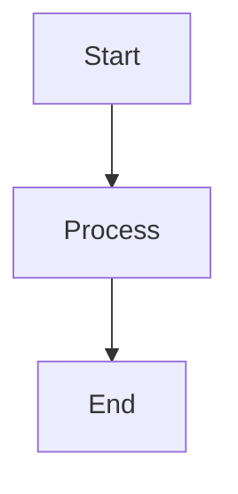

# Blog Format Guide

This guide documents the standard formatting conventions for blog posts on subramanya.ai based on the established content library.

## Front Matter Structure

Every blog post must start with YAML front matter enclosed in `---`:

```yaml
---
layout: post
title: "Your Post Title"
excerpt: Brief description of the post (1-2 sentences). This appears in previews and meta descriptions.
author: Subramanya N
date: YYYY-MM-DD
tags: [Tag1, Tag2, Tag3, Tag4]
ready: true
---
```

### Optional Front Matter Fields

```yaml
image: /assets/images/filename.png          # Featured image for social sharing
mermaid: true                               # Enable mermaid diagrams
```

## Content Structure

### 1. Opening Paragraph
- Start with a strong hook that establishes context
- No heading for the opening - dive straight into content
- 1-3 paragraphs that set up the problem or topic

### 2. Section Headings
- Use `##` for main sections
- Use `###` for subsections
- Use `####` for sub-subsections (rarely needed)
- Keep headings concise and descriptive

### 3. Code Blocks
Use triple backticks with language specification:

````markdown
```python
def example():
    return "code here"
```
````

Common languages: `python`, `bash`, `javascript`, `json`, `yaml`, `console`, `sql`, `typescript`

### 4. Images with Captions

```markdown
{:.post-img}
<span class="post-img-caption">Your detailed caption here</span>
```

**Important**: Always include both the image class `{:.post-img}` and a caption span.

### 5. Mermaid Diagrams

When using diagrams, add `mermaid: true` to front matter, then use:

````markdown

````

Common diagram types:
- `graph TD` / `graph LR` - Flowcharts
- `sequenceDiagram` - Sequence diagrams
- `timeline` - Timeline diagrams
- `mindmap` - Mind maps

### 6. Tables

Use markdown table format with alignment:

```markdown
| Column 1 | Column 2 | Column 3 |
|:---------|:---------|:---------|
| Left     | Center   | Right    |
| Data     | Data     | Data     |
```

For centered headers: `|:--------:|`
For right-aligned: `|---------:|`

**Advanced**: Some posts use custom CSS classes:

```html
<table class="custom-table">
    <thead>
        <tr>
            <th>Header</th>
        </tr>
    </thead>
    <tbody>
        <tr>
            <td>Data</td>
        </tr>
    </tbody>
</table>
```

### 7. Blockquotes

Use for important callouts or quotes:

```markdown
> "This is a quote or important callout that deserves emphasis."
```

### 8. Emphasis

- **Bold** (`**text**`) for important terms, key concepts, or emphasis
- *Italic* (`*text*`) for subtle emphasis or technical terms
- `Code` (`` `text` ``) for inline code, commands, or technical references

### 9. Lists

**Unordered lists:**
```markdown
- Item one
- Item two
  - Nested item
- Item three
```

**Ordered lists:**
```markdown
1. First step
2. Second step
3. Third step
```

### 10. Links

Internal links (to other blog posts):
```markdown
[Link Text]({{ site.baseurl }}/YYYY/MM/DD/post-slug/)
```

External links:
```markdown
[Link Text](https://example.com)
```

### 11. Inline Code Highlighting

For file paths, commands, or short code snippets:
```markdown
Use the `git commit` command or edit the `config.yml` file.
```

## References Section

**Always end with a References section** if you cite sources:

```markdown
**References:**

[1] [Author. (Year). *Title*. Publication.](URL)

[2] [Author. (Year). *Title*. Publication.](URL)
```

**Format notes:**
- Use bold `**References:**` heading
- Number references in order of appearance
- Include clickable URLs
- Use italics for publication/article titles with `*Title*`

## Writing Style Guidelines

### Technical Content
- Start with context before diving into technical details
- Use concrete examples to illustrate abstract concepts
- Break complex topics into digestible sections
- Include diagrams for architectural or process explanations

### Tone
- Professional but conversational
- Authoritative without being condescending
- Use "we" for shared journey, "you" when addressing reader directly
- Avoid jargon unless defined or necessary

### Structure Patterns

**Problem-Solution Pattern:**
1. Establish the problem/challenge
2. Explain why it matters
3. Present the solution
4. Show implementation or impact
5. Conclude with takeaways

**Explanatory Pattern:**
1. Introduce the concept
2. Break down components
3. Explain how it works
4. Provide examples
5. Discuss implications

**Analysis Pattern:**
1. Present the landscape/situation
2. Analyze key aspects
3. Compare approaches
4. Synthesize insights
5. Discuss future directions

## Special Formatting

### Videos
```html
<video controls class="post-img">
    <source src="/assets/videos/filename.mp4" type="video/mp4">
</video>
<span class="post-img-caption">Video caption here</span>
```

### Twitter Embeds
```html
<blockquote class="twitter-tweet"><p lang="en" dir="ltr">Tweet text</p>&mdash; Author (@handle) <a href="URL">Date</a></blockquote>
<script async src="https://platform.twitter.com/widgets.js" charset="utf-8"></script>
```

### Custom Styling (when needed)
Some posts include custom CSS at the end:
```html
<style>
.custom-table {
    /* styles here */
}
</style>
```

## File Naming Convention

Blog post files follow this pattern:
```
YYYY-MM-DD-post-title-with-hyphens.md
```

Example: `2025-12-26-context-graphs-my-thoughts.md`

## Common Mistakes to Avoid

1. ❌ Missing front matter fields
2. ❌ Inconsistent heading hierarchy (skipping levels)
3. ❌ Images without captions
4. ❌ Code blocks without language specification
5. ❌ Missing References section when citing sources
6. ❌ Inconsistent date formats (always use YYYY-MM-DD)
7. ❌ Broken internal links (check `site.baseurl`)
8. ❌ Tables without proper alignment markers

## Quick Checklist

Before publishing, verify:
- [ ] Front matter complete and valid
- [ ] All images have captions
- [ ] Code blocks have language tags
- [ ] Tables render correctly
- [ ] All links work
- [ ] References formatted properly
- [ ] Mermaid diagrams work (if used)
- [ ] `ready: true` is set in front matter
