---
layout: post
title: 'Securing MCP with OIDC & OIDC-A: Identity-Aware API Gateways Beyond "Glorified API Calls"'
excerpt: Integrating OpenID Connect (OIDC) and the new OIDC-A agent extension with an identity-aware API gateway to securely authenticate users, LLM agents, and MCP tools—going far beyond basic API proxying.
author: Subramanya N
date: 2025-05-21
tags: [OIDC, API Gateway, Security, Authentication, Authorization, Cloud, MCP, Architecture]
mermaid: true
ready: true
--- 

AI agents are quickly moving from research demos to real enterprise applications, connecting large language models (LLMs) with company data and services. A common approach is using tools or plugins to let an LLM fetch context or take actions – but some dismiss these as just "glorified API calls." In reality, securely integrating AI with business systems is far more complex. This is where the **Model Context Protocol (MCP)** comes in, and why a robust **proxy architecture with OpenID Connect (OIDC)** identity is crucial for enterprise-scale deployments.

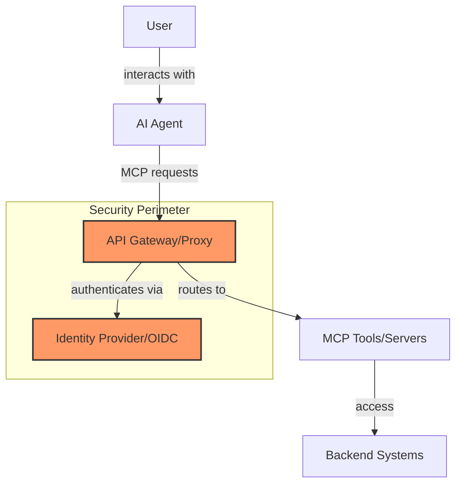

The diagram above illustrates the high-level architecture of a secure MCP implementation. At its core, this architecture places an API Gateway/Proxy as the central security control point between AI agents and MCP tools. The proxy works in conjunction with an Identity Provider supporting OIDC to create a security perimeter that enforces authentication, authorization, and access controls. This ensures that all MCP requests from AI agents are properly authenticated and authorized before reaching the actual MCP tools, which in turn access various backend systems.

MCP is an open standard (originally introduced by Anthropic) that provides a consistent way for AI assistants to interact with external data sources and tools. Instead of bespoke integrations for each system, MCP acts like a universal connector, allowing AI models to retrieve context or execute tasks via a standardized JSON-RPC interface. Importantly, MCP was **built with security in mind** – nothing is exposed to the AI by default, and it only gains access to what you explicitly allow. In practice, however, ensuring that "allow list" principle across many tools and users requires careful infrastructure. A production-grade **API gateway (proxy)** can serve as the gatekeeper between AI agents (MCP clients) and the tools or data sources (MCP servers), enforcing authentication, authorization, and routing rules.

*Before diving into the solution, a quick note on Envoy:* there are active proposals to use Envoy Proxy as a reference implementation of an MCP gateway. Envoy's rich L7 routing and extensibility make it a strong candidate, and it may soon include first-class MCP support. That said, the pattern we discuss here is **proxy-agnostic** – any modern HTTP reverse proxy or API gateway (Envoy, NGINX, HAProxy, Kong, etc.) that offers similar capabilities can be used. The goal is to outline a *secure architecture* for MCP, rather than the specifics of Envoy configuration.

## Beyond "Glorified API Calls": The Need for Secure MCP Integration

At first glance, using an AI tool via MCP might seem as simple as calling a web API. In a basic demo, an LLM agent could hit a REST endpoint, get some JSON, and that's that. But in a real enterprise scenario, a lot more is happening behind the scenes:

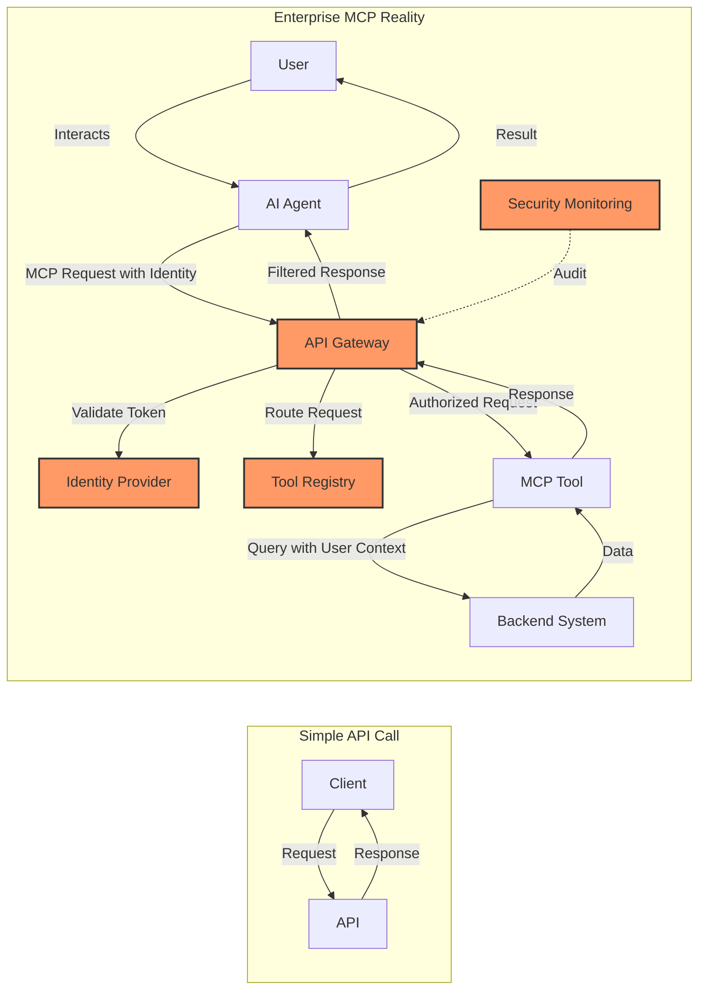

This diagram contrasts a simple API call with the complex reality of enterprise MCP implementations. In the simple case, a client makes a direct request to an API and receives a response. However, in the enterprise MCP reality, the flow is much more complex:

1. A user interacts with an AI agent
2. The agent makes an MCP request that includes the user's identity token
3. The API Gateway validates this token with an Identity Provider
4. The Gateway consults a Tool Registry to determine routing
5. If authorized, the request is forwarded to the appropriate MCP tool
6. The tool queries backend systems using the user's context
7. Data flows back through the tool to the gateway
8. The gateway may filter the response based on security policies
9. The filtered response reaches the AI agent
10. The agent presents the result to the user

Throughout this process, security monitoring systems audit the interactions at the gateway level. This comprehensive flow ensures that user identity, permissions, and security policies are enforced at every step, far beyond what a simple API call would entail.

* **User Identity and Access Control:** In an interactive AI application (like a chat assistant that can query internal systems), each request originates from a user with specific permissions. The system must ensure the AI only accesses data or performs actions that the *current user* is allowed to. Unlike a typical API call where a user directly authenticates to the service, here the AI agent is calling on the user's behalf. Without a proper identity propagation mechanism, you risk turning a simple tool call into a serious data leak or privilege violation.
* **Multi-Step Context Exchanges:** MCP supports stateful sessions and streaming interactions. An AI agent might carry on a multi-turn conversation, calling several tools in sequence and synthesizing their outputs. This is far beyond a one-off API call. The longer this chain goes, the higher the chance of things like **context poisoning** – where erroneous or malicious data from one step influences subsequent steps. We need safeguards so that a malicious response from one tool cannot trick the model into doing something dangerous in the next step.
* **Complex Delegation Chains:** Related to the above, consider when tools call other tools. For example, an AI might use a "file search" tool which itself queries a database or calls another API. This delegation chain should carry forward the original user's permissions and context **without** over-privileging any step. Each hop needs consistent enforcement of "who is allowed to do what," or else an intermediate service might execute an action the user didn't intend. Managing these delegated authorizations is non-trivial.
* **Dynamic Tool Provisioning:** In agile environments, new tools (MCP servers) will be added frequently – think of spinning up a new microservice and immediately making it available to AI agents, or letting third-party plugins be installed. This dynamism is great for flexibility but a headache for security. How do you ensure every new tool meets your security standards? How do you prevent an unvetted or even malicious tool from being introduced? A free-for-all approach can quickly lead to chaos or breach. Clearly defined **onboarding, registration, and policy enforcement** for tools is needed from day one.

In short, an enterprise must treat AI tool integrations with the same rigor as any production service integration – if not more. A **proper gateway layer** helps address these concerns by acting as a central control point. Instead of hard-coding trust into each AI agent or tool, the proxy imposes organization-wide security policies. This approach moves us *beyond the "just call an API" mindset* to a structured model where every MCP call is authenticated, authorized, monitored, and audited.

## Key Security Challenges in MCP Workflows

Let's examine a few specific security challenges that arise when deploying MCP at scale, and why they matter:

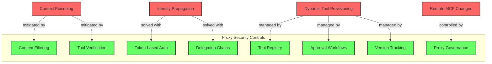

This diagram maps the key security challenges in MCP workflows (shown in red) to their corresponding solutions (shown in green) that can be implemented within the proxy security controls. The diagram illustrates how:

- Context poisoning is mitigated through content filtering and tool verification
- Identity propagation challenges are solved with token-based authentication and proper delegation chains
- Dynamic tool provisioning risks are managed through a tool registry, approval workflows, and version tracking
- Remote MCP changes are controlled through proxy governance

By implementing these controls within the proxy layer, organizations can address these security challenges in a centralized, consistent manner rather than trying to solve them individually for each tool or agent.

* **Context Poisoning:** Because MCP enables feeding external data into the model's context, there's a risk that data could be deliberately crafted to mislead or exploit the model. This could be a form of prompt injection – e.g. a document retrieved via a tool might contain instructions that hijack the model's behavior. A malicious actor might also try to register a tool that returns toxic content or false information. The architecture needs ways to validate and sanitize context coming from tools. Mitigations can include content filtering on responses, verifying data against expectations, or restricting which tools the model trusts for certain queries.
* **Delegation Chains and Identity Propagation:** As mentioned, an AI agent often acts on behalf of a user. When it calls an MCP server, it should pass along *who* the user is (or at least what they're allowed to do). If a tool then calls a backend API, that backend might also need credentials. This chain of delegation is tricky – you want to avoid the "sharing passwords" anti-pattern or hardcoding keys in the open. Instead, solutions involve tokens and OAuth flows: e.g. the user consents and an OAuth2/OIDC token is issued, the AI carries that token in MCP requests, and the MCP server can **pass it through** to the backend API (or exchange it). Managing these tokens and ensuring they're used correctly (and not by someone else) is a core security task. The proxy should facilitate this by attaching and validating identity context at each step. It also enables **RBAC policies** – e.g. only allow certain tool methods if the user's role is admin.

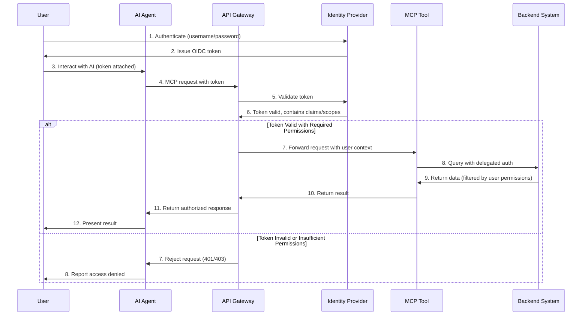

This sequence diagram illustrates the authentication and authorization flow in an MCP system using OIDC. The process begins with the user authenticating to an Identity Provider and receiving an OIDC token. This token is then attached to the user's interactions with the AI agent. When the agent makes an MCP request, it includes this token, which the API Gateway validates with the Identity Provider.

If the token is valid and contains the necessary permissions (claims/scopes), the request is forwarded to the appropriate MCP tool along with the user's context. The tool can then query backend systems using delegated authentication, ensuring that the data returned is filtered according to the user's permissions. The result flows back through the system to the user.

If the token is invalid or lacks sufficient permissions, the request is rejected at the gateway level with an appropriate error code (401 Unauthorized or 403 Forbidden), and the AI agent reports this access denial to the user.

This flow ensures that user identity and permissions are consistently enforced throughout the entire interaction chain, preventing unauthorized access to sensitive data or operations.

* **Dynamic Tool Provisioning:** In an MCP ecosystem, tools can come and go. For example, an enterprise might quickly stand up a new MCP server for a specific dataset or integrate a third-party service via MCP. Without controls, an AI agent might immediately start invoking any new tool as soon as it appears. That's risky – you might not want a newly added tool to be available to everyone by default, or it might need vetting. There's also the configuration aspect: new tool endpoints should be discoverable by the AI, and the gateway needs to know how to route to them and what auth to require. A secure setup will likely involve a **tool registry** or discovery service that the proxy consults, and administrative approval for tools. The proxy can then automatically enforce the appropriate auth and routing for each new tool, rather than relying on each agent developer to update logic. This provides a governance layer for tool lifecycle.

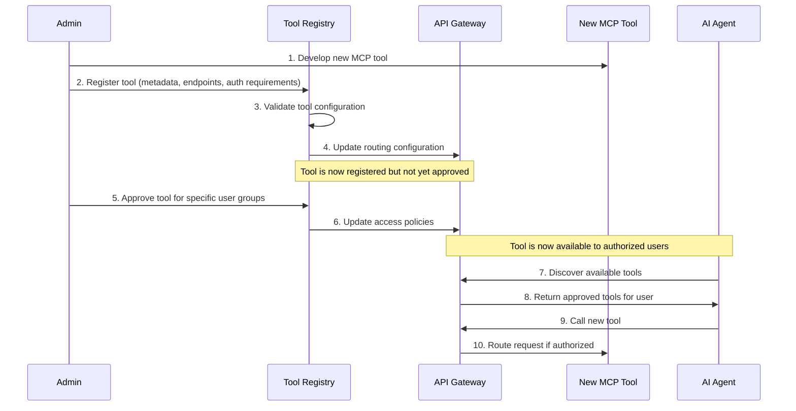

This sequence diagram illustrates the tool registration and approval workflow in a secure MCP environment. The process begins with an administrator developing a new MCP tool and registering it in the Tool Registry, providing metadata, endpoints, and authentication requirements. The registry validates the tool configuration and updates the routing configuration in the API Gateway.

At this point, the tool is registered but not yet approved for use. The administrator must explicitly approve the tool for specific user groups, which triggers an update to the access policies in the API Gateway. Only then does the tool become available to authorized users.

When an AI agent discovers available tools through the proxy, it only receives information about tools that have been approved for the current user. When the agent calls the new tool, the proxy routes the request to the tool only if the user is authorized to access it.

This workflow ensures that new tools undergo proper vetting and approval before they can be used, and that access is restricted to authorized users only. It also centralizes the tool governance process, making it easier to manage the lifecycle of MCP tools in a secure manner.

By recognizing these challenges, security engineers and architects can design defenses *before* problems occur. We next look at how an identity-aware proxy can provide those defenses in a clean, centralized way.

## The Identity-Aware Proxy Pattern for MCP

A proven design in cloud architectures is to put a **reverse proxy** (often called an API gateway) in front of your services. MCP-based AI systems are no exception. By introducing an intelligent proxy between AI agents (clients) and the MCP servers (tools/backends), we create a controlled funnel through which all AI tool traffic passes. This proxy can operate at Layer 7 (application layer), meaning it understands HTTP and even JSON payloads, allowing fine-grained control. Below, we outline the key roles such a proxy plays in securing MCP:

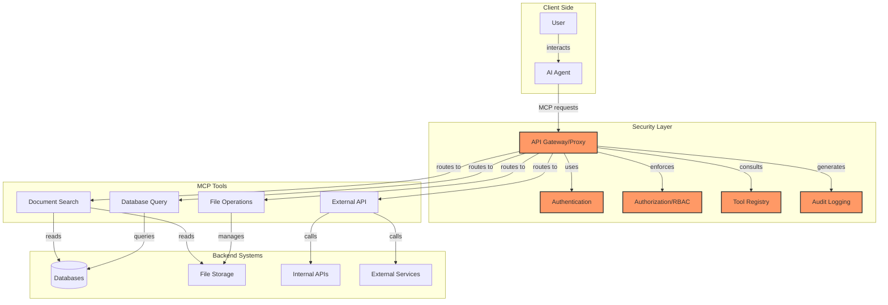

This diagram provides a detailed view of the identity-aware proxy pattern for MCP. The architecture is divided into four main layers:

1. **Client Side**: Users interact with AI agents, which generate MCP requests.
2. **Security Layer**: The API Gateway/Proxy sits at the center of the security layer, working with authentication, authorization/RBAC, tool registry, and audit logging components to enforce security policies.
3. **MCP Tools**: Various tools like document search, database query, file operations, and external API access are available through the MCP interface.
4. **Backend Systems**: The actual data sources and services that the MCP tools interact with, including databases, file storage, internal APIs, and external services.

All MCP requests from AI agents must pass through the proxy, which authenticates the requests, enforces RBAC policies, consults the tool registry to determine routing, and generates audit logs. The proxy then routes authorized requests to the appropriate MCP tools, which in turn interact with the backend systems.

This centralized security architecture ensures consistent enforcement of security policies across all MCP interactions, regardless of which tools are being used or which backend systems are being accessed.

### Session-Aware Routing and Load Balancing

Unlike a simple stateless API call, MCP sessions can be long-lived and involve streaming (Server-Sent Events for output, etc.). The proxy should ensure that all requests and responses belonging to a given session or conversation are handled consistently. This often means implementing **session affinity** – if multiple instances of an MCP server are running, the proxy will route a given session's traffic to the same instance each time. This prevents issues where, say, tool A's state (in-memory cache, context window, etc.) is lost because request 2 went to a different instance than request 1. Modern proxies can do session-aware load balancing using HTTP headers or routes (for example, mapping a session ID or client ID in the URL to a particular backend). Additionally, the proxy can handle SSE connections gracefully, so that streaming responses aren't accidentally broken by network intermediaries. Should a session need to be resumed or handed off, the gateway can coordinate that (as proposed in upcoming Envoy features for MCP). In short, the proxy ensures reliability and consistency for MCP's stateful interactions, which is crucial for user experience and for maintaining correct context.

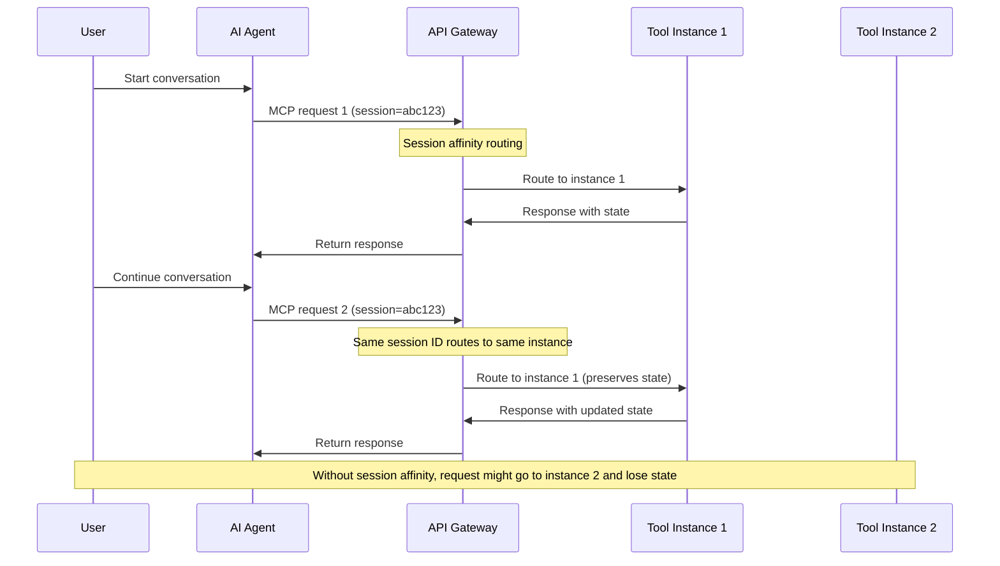

This sequence diagram illustrates how session affinity works in an MCP environment. When a user starts a conversation with an AI agent, the agent makes an MCP request to the API Gateway with a session identifier (in this case, "abc123"). The gateway uses this session ID to route the request to a specific tool instance (Instance 1).

When the user continues the conversation, the agent makes another MCP request with the same session ID. Because the gateway implements session affinity, it routes this request to the same instance (Instance 1), which preserves the state from the previous interaction. This ensures a consistent and coherent experience for the user.

Without session affinity, the second request might be routed to a different instance (Instance 2), which would not have the state information from the first request. This would result in a broken experience, as the tool would not have the context of the previous interaction.

Session affinity is particularly important for MCP because many AI interactions are stateful and context-dependent. The proxy's ability to maintain this session consistency is a key advantage over simpler API integration approaches.

### JWT and OIDC Integration for Authentication

Every request hitting the MCP gateway should carry a valid identity token – typically a JSON Web Token (JWT) issued by an Identity Provider via OIDC (OpenID Connect). By requiring JWTs, the proxy offloads authentication from the tools themselves and ensures that only authenticated, authorized calls make it through. In practice, this means the AI agent (or the user's session with the agent) must obtain an OIDC token (for example, an ID token or access token) and attach it to each MCP request (often in an HTTP header like `Authorization: Bearer <token>`). The proxy verifies this token, checks signature and claims (issuer, audience, expiration, etc.), and rejects any request that isn't properly authenticated. This way, your MCP servers never see an anonymous call – they trust the gateway to have vetted identity.

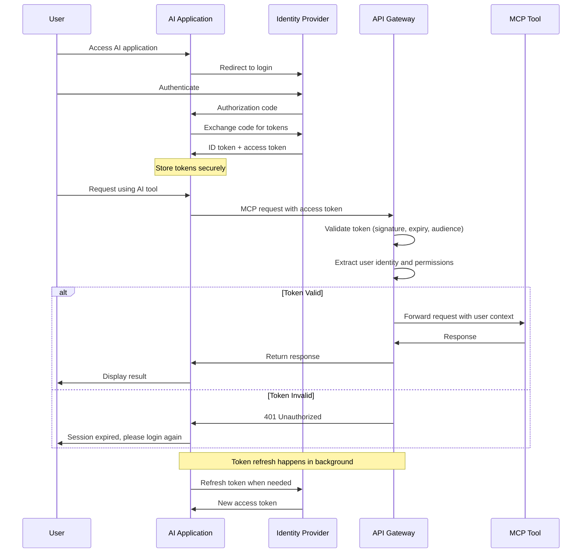

This sequence diagram illustrates the OIDC authentication flow in an MCP environment. The process begins when a user accesses the AI application, which redirects to the Identity Provider for authentication. After the user authenticates, the Identity Provider issues an authorization code, which the application exchanges for ID and access tokens.

The application securely stores these tokens and uses the access token when making MCP requests through the AI agent. When the proxy receives a request, it validates the token by checking the signature, expiration, audience, and other claims. It also extracts the user's identity and permissions from the token.

If the token is valid, the proxy forwards the request to the appropriate MCP tool along with the user's context. The tool processes the request and returns a response, which flows back through the proxy to the application and ultimately to the user.

If the token is invalid (expired, tampered with, etc.), the proxy returns a 401 Unauthorized response, and the application prompts the user to log in again.

In the background, the application can use a refresh token to obtain new access tokens when needed, without requiring the user to re-authenticate. This ensures a smooth user experience while maintaining security.

This OIDC integration provides a robust authentication mechanism that is widely adopted in enterprise environments and integrates well with existing identity management systems.

### Introducing OIDC-A for Agent & Tool Identity

While the discussion above focuses on authenticating the **human user**, a production-grade MCP deployment must also identify two additional actors:

1. The *LLM agent* that is orchestrating the workflow.
2. The *MCP tool / resource* that is being invoked on the backend.

Our companion post "**OpenID Connect for Agents (OIDC-A) 1.0 Proposal**" ({{ site.baseurl }}/2025/04/28/oidc-a-proposal/) extends OIDC Core 1.0 with a rich set of claims for **agent identity, attestation, and delegation chains**.  In practice this means:

* When an AI agent starts a session it obtains an **ID Token** that contains the OIDC-A claims (`agent_type`, `agent_model`, `agent_instance_id`, `delegator_sub`, `delegation_chain`, etc.).  This token travels alongside the user's access token in every MCP request.
* MCP tools can likewise expose their own OIDC identity (or be issued a signed *resource token*) that advertises metadata such as tool capabilities, version, and trust level (`agent_capabilities`, `agent_trust_level`, `agent_attestation`).
* The gateway now validates up to **three** identities on every call – **user → agent → tool** – forming an explicit *delegation chain* that can be evaluated against RBAC and compliance policies.

Adopting OIDC-A brings several benefits:

* End-to-end, cryptographically verifiable identity for everything that touches the request path.
* Fine-grained authorisation based on agent or tool capabilities (e.g., allow only agents that advertise `email:draft` capability to invoke the Mail tool).
* Built-in attestation (`agent_attestation`) enables the gateway to verify the integrity and provenance of both agents and tools before routing traffic to them.

For the remainder of this article, whenever we refer to a "token" being validated by the gateway, assume this now encompasses **the user's token, the agent's OIDC-A token, and (optionally) the tool/resource token** – all evaluated in a single policy decision step.

This pattern is already used widely in API security: *"an API Gateway can securely and consistently implement authentication… without burdening the applications themselves."* In our context, the MCP proxy might integrate with your enterprise SSO (Azure AD, Okta, etc.) via OIDC to handle user login flows and token validation. Many gateways support OIDC natively, initiating redirects for user login if needed and then storing the resulting token in a cookie for session continuity. In a headless agent scenario (where the AI is calling tools server-to-server), the token might be provisioned out-of-band (e.g. the user logged into the AI app, so the app injects the token for the agent to use). Either way, the gateway enforces that **no token = no access**. It can also map token claims to roles or scopes to implement authorization (e.g., only users with an "HR_read" scope can use the "HR Database" tool). This aligns perfectly with MCP's design goal of secure connections – combining MCP with OIDC and OIDC-A gives you an end-to-end authenticated channel for tool usage.

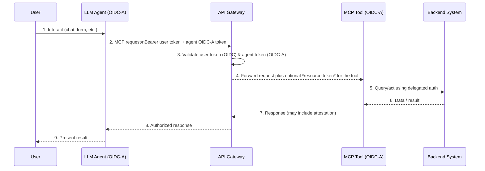

### Tool Metadata Filtering and Policy Enforcement

A powerful advantage of the proxy is that it can make routing decisions based not just on URLs, but on *metadata* within the requests. With MCP, requests and responses are in JSON-RPC format, which includes fields like the tool method name, parameters, and even tool annotations. An identity-aware proxy can be configured to inspect these details and apply **policy rules**. For example, you might configure rules such as:

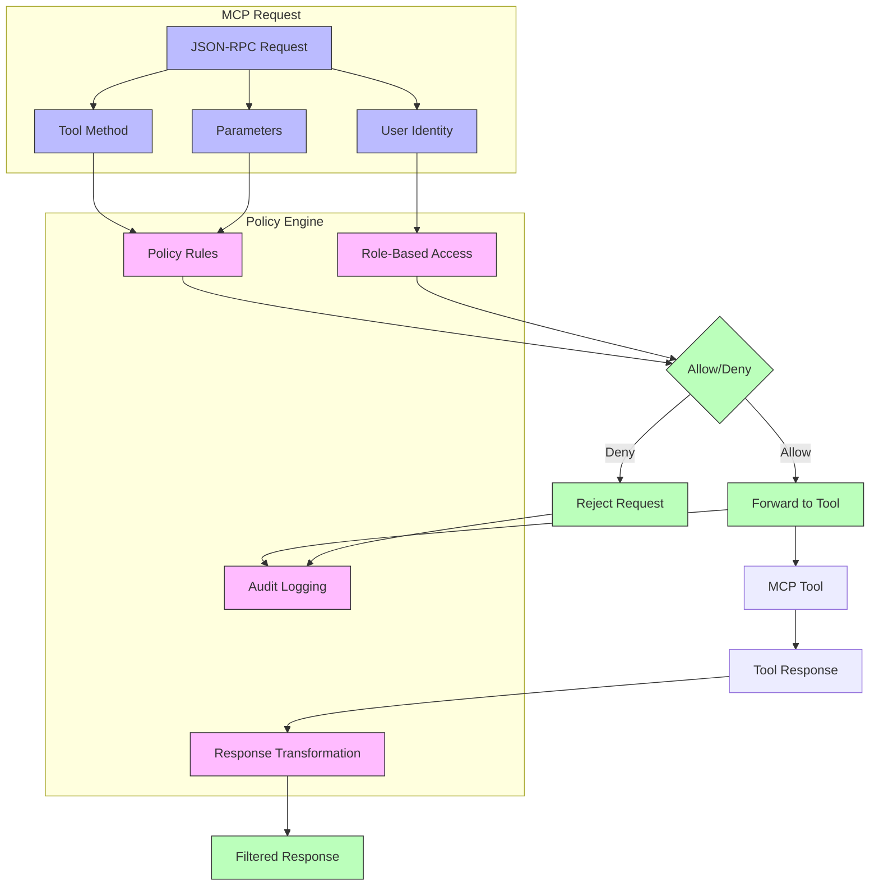

This diagram illustrates how tool metadata filtering and policy enforcement work in an MCP proxy. The process begins with an MCP request in JSON-RPC format, which contains the tool method, parameters, and user identity information. These components are extracted and fed into the policy engine.

The policy engine consists of policy rules, role-based access control (RBAC), audit logging, and response transformation components. The tool method and parameters are evaluated against the policy rules, while the user identity is checked against RBAC permissions.

Based on these evaluations, the policy engine makes an allow/deny decision. If the request is allowed, it is forwarded to the MCP tool; if denied, it is rejected. In either case, the action is logged for audit purposes.

When a request is allowed and processed by the tool, the response may pass through a transformation step before being returned to the client. This transformation can filter or modify the response based on security policies, such as removing sensitive information that the user shouldn't see.

This fine-grained policy enforcement at the metadata level allows for sophisticated security controls that go far beyond simple URL-based routing. For example:

* *"If the tool call is `delete_file` and the user is not in the IT Admin group, deny the request."*
* *"Only allow the `execute_sql` tool on weekdays between 9am-5pm, and log all queries."*
* *"If a tool is marked as containing sensitive data, ensure the response is sanitized or encrypted."*

This is analogous to a web application firewall (WAF) or an API gateway performing content filtering, but tailored to AI tool usage. In the Envoy MCP proposal, this corresponds to parsing MCP messages and using RBAC filters on them. The proxy essentially understands the *intent* of each tool call and can gate it appropriately. It also can redact or transform data if needed – for instance, stripping out certain fields from a response that the user shouldn't see, or masking personally identifiable information. By centralizing this in the gateway, you avoid having to implement checks in each tool service (which could be inconsistent or forgotten). **Auditing** is another benefit: the proxy can log every tool invocation along with user identity and parameters, feeding into SIEM systems for monitoring. That way, if an AI one day does something it shouldn't, you have a clear trail of which tool call was involved and who prompted it. In sum, metadata-based filtering turns the proxy into a smart policy enforcement point, adding a safety layer on top of MCP's basic capabilities.

### Version-Aware and Context-Aware Routing

Enterprises constantly evolve their services – new versions, A/B tests, staging vs. production deployments, etc. The proxy can greatly simplify how AI agents handle these changes. Instead of the AI needing to know which version of a tool to call, the gateway can implement **version-aware routing**. For instance, the MCP endpoint for a "Document Search" tool could remain the same for the agent, but the proxy might route 90% of requests to v1 of the service and 10% to a new v2 (for a canary rollout). Or route internal users to a "beta" instance while external users go to stable. This is done by matching on request attributes or using routing rules that include user audience and tool identifiers.

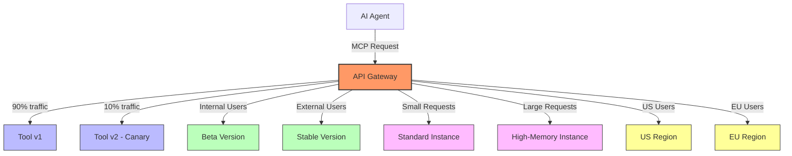

This diagram illustrates the various routing strategies that an API Gateway can implement for MCP requests. The gateway can route traffic based on multiple factors:

1. **Version-based routing**: The gateway can split traffic between different versions of a tool, such as sending 90% to v1 and 10% to a canary deployment of v2. This allows for gradual rollouts and A/B testing without requiring changes to the AI agents.

2. **Audience-based routing**: Internal users can be directed to beta versions of tools, while external users are routed to stable versions. This allows for internal testing and validation before wider release.

3. **Request size-based routing**: Small requests can be handled by standard instances, while large requests that require more resources are directed to high-memory instances. This optimizes resource utilization and ensures that demanding requests don't impact the performance of standard operations.

4. **Geographic routing**: Users from different regions can be directed to region-specific instances, reducing latency and potentially addressing data residency requirements.

The AI agent doesn't need to be aware of these routing decisions; it simply makes requests to the logical tool name, and the gateway handles the complexity of routing to the appropriate backend. This abstraction simplifies the agent's implementation while providing powerful operational capabilities.

Similarly, routing can consider **context** – e.g., direct requests to the nearest regional server for lower latency if the user's location is known, or choose a different backend depending on the size of the request (perhaps a special high-memory instance for very large files). All of this is configurable at the proxy level. The AI agent simply calls the logical tool name, and the gateway takes care of finding the right backend. This not only eases operations (you can upgrade backend tools without breaking the AI's interface), but also adds to security. You could isolate certain versions for testing, or ensure that experimental tools are only accessible under certain conditions. By controlling traffic flow, the proxy helps maintain a **principle of least privilege** on a macro scale – the AI only reaches the backends it's supposed to, via routes that are appropriate for the current context.

## Implementing MCP Security with a Proxy: A Practical Approach

Now that we've covered the key security patterns, let's look at a practical approach to implementing MCP security with an identity-aware proxy. This section outlines the steps to set up a secure MCP environment, focusing on the integration points between components.

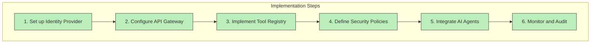

This diagram outlines the six key steps in implementing MCP security with a proxy. The process follows a logical progression:

1. **Set up Identity Provider**: Establish the foundation for authentication and authorization.
2. **Configure API Gateway**: Set up the central security control point.
3. **Implement Tool Registry**: Create a system for managing MCP tools.
4. **Define Security Policies**: Establish the rules for access control and data protection.
5. **Integrate AI Agents**: Connect the AI agents to the secure MCP environment.
6. **Monitor and Audit**: Continuously track and review system activity.

Each step builds on the previous ones, creating a comprehensive security implementation. The following sections will explore each step in detail.

### 1. Setting Up the Identity Provider

The first step is to configure your identity provider (IdP) to support the OIDC flows needed for MCP security. This typically involves:

1. Creating an OIDC application in your IdP (e.g., Azure AD, Okta, Auth0)
2. Configuring the appropriate scopes and claims
3. Setting up the redirect URIs for your AI application
4. Generating client credentials (client ID and secret)

The IdP will be responsible for authenticating users and issuing the tokens that will be used to secure MCP requests. It's important to configure the appropriate scopes and claims to ensure that the tokens contain the necessary information for authorization decisions.

### 2. Configuring the API Gateway

Next, you'll need to configure your API gateway to act as the MCP proxy. This involves:

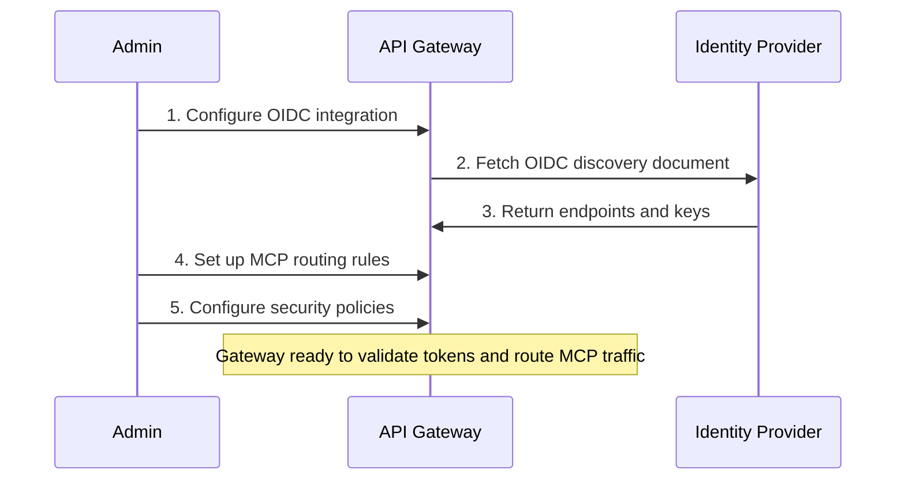

This sequence diagram illustrates the process of configuring an API Gateway for MCP security. The process begins with an administrator configuring the OIDC integration in the gateway. The gateway then fetches the OIDC discovery document from the Identity Provider, which returns the necessary endpoints and keys for token validation.

Next, the administrator sets up MCP routing rules, defining how requests should be directed to different MCP tools based on various criteria. The administrator also configures security policies, specifying who can access which tools and under what conditions.

Once these configurations are complete, the gateway is ready to validate tokens and route MCP traffic according to the defined rules and policies. This setup process establishes the gateway as the central security control point for all MCP interactions.

The configuration steps include:

1. Setting up the OIDC integration, including configuring the token validation parameters (issuer, audience, etc.)
2. Defining the routing rules for MCP requests
3. Configuring the security policies for tool access
4. Setting up the audit logging

The gateway will be responsible for validating the tokens, enforcing the security policies, and routing the MCP requests to the appropriate backends. It's important to ensure that the gateway is properly configured to handle the MCP JSON-RPC format and to extract the necessary information for policy decisions.

### 3. Implementing the Tool Registry

A tool registry is essential for managing the lifecycle of MCP tools in your environment. This involves:

1. Creating a database or service to store tool metadata
2. Defining the registration process for new tools
3. Implementing the approval workflow for tool access
4. Integrating the registry with the API gateway

The tool registry will be responsible for maintaining the list of available tools, their endpoints, and their access requirements. It will also provide the necessary information to the API gateway for routing and policy enforcement.

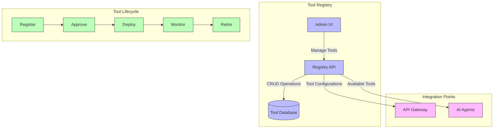

This diagram illustrates the components and lifecycle of a Tool Registry in an MCP environment. The Tool Registry consists of three main components:

1. **Tool Database**: Stores metadata about all registered MCP tools, including their endpoints, versions, access requirements, and status.
2. **Registry API**: Provides programmatic access to the tool database, enabling CRUD operations on tool registrations.
3. **Admin UI**: Allows administrators to manage tools through a user interface, including registration, approval, and monitoring.

The Tool Registry integrates with two key systems:
- **API Gateway**: Receives tool configurations from the registry, which inform routing and policy decisions.
- **AI Agents**: Discover available tools through the registry, based on user permissions and tool status.

The diagram also shows the lifecycle of an MCP tool:
1. **Register**: A new tool is registered in the system with its metadata.
2. **Approve**: The tool undergoes review and is approved for use by specific user groups.
3. **Deploy**: The tool is made available in the production environment.
4. **Monitor**: The tool's usage and performance are monitored.
5. **Retire**: When no longer needed, the tool is retired from the system.

This comprehensive approach to tool management ensures that all MCP tools are properly vetted, deployed, and monitored throughout their lifecycle, reducing security risks and operational issues.

### 4. Defining Security Policies

Security policies are the rules that govern access to MCP tools. This involves:

1. Defining the RBAC policies for tool access
2. Configuring the content filtering rules for responses
3. Setting up the audit logging requirements
4. Implementing the version control policies

The security policies will be enforced by the API gateway based on the user's identity and the tool being accessed. It's important to ensure that the policies are comprehensive and aligned with your organization's security requirements.

### 5. Integrating AI Agents

Finally, you'll need to integrate your AI agents with the secure MCP environment. This involves:

1. Configuring the agents to obtain and use OIDC tokens
2. Implementing the MCP client functionality
3. Handling authentication and authorization errors
4. Managing token refresh and session continuity

The AI agents will be responsible for obtaining the necessary tokens and including them in MCP requests. They'll also need to handle authentication and authorization errors gracefully, providing appropriate feedback to users.

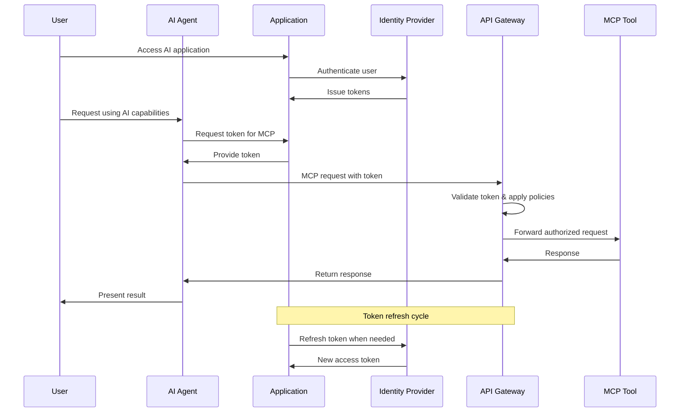

This sequence diagram illustrates the integration of AI agents with a secure MCP environment. The process begins when a user accesses the AI application, which authenticates the user with the Identity Provider and receives tokens.

When the user makes a request that requires AI capabilities, the AI agent requests a token from the application, which provides it. The agent then includes this token in its MCP request to the API Gateway.

The gateway validates the token and applies security policies to determine if the request should be allowed. If authorized, the request is forwarded to the appropriate MCP tool, which processes it and returns a response. This response flows back through the gateway to the agent and ultimately to the user.

In the background, the application handles token refresh cycles, requesting new access tokens from the Identity Provider when needed. This ensures continuous operation without requiring the user to re-authenticate frequently.

This integration approach ensures that AI agents operate within the security framework established by the proxy architecture, with all requests properly authenticated and authorized.

## Conclusion: Beyond Glorified API Calls

By implementing a secure MCP architecture with an identity-aware proxy, you move far beyond "glorified API calls" to a robust, enterprise-grade integration between AI agents and your business systems. This approach addresses the key security challenges of MCP deployments, including:

- User identity and access control
- Multi-step context exchanges
- Complex delegation chains
- Dynamic tool provisioning
- Remote MCP changes and version tracking

The proxy-based architecture provides a centralized control point for enforcing security policies, managing tool access, and monitoring AI agent activity. It also simplifies operations by abstracting away the complexity of backend services and providing a consistent interface for AI agents.

As MCP continues to evolve and gain adoption, the security patterns described in this article will become increasingly important for enterprise deployments. By implementing these patterns now, you can ensure that your AI agent infrastructure is secure, scalable, and ready for the future.

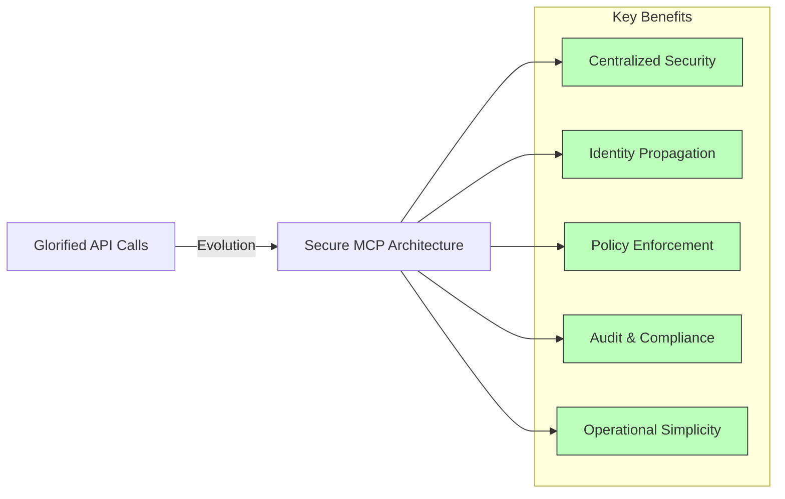

This final diagram summarizes the evolution from "glorified API calls" to a secure MCP architecture, highlighting the key benefits of this approach:

1. **Centralized Security**: A single control point for enforcing security policies across all MCP interactions.
2. **Identity Propagation**: Consistent handling of user identity and permissions throughout the system.
3. **Policy Enforcement**: Fine-grained control over who can access which tools and under what conditions.
4. **Audit & Compliance**: Comprehensive logging and monitoring of all MCP activities for security and compliance purposes.
5. **Operational Simplicity**: Abstraction of backend complexity, making it easier to manage and evolve the system over time.

By adopting this architecture, organizations can confidently deploy AI agents in enterprise environments, knowing that their MCP interactions are secure, auditable, and manageable at scale. This represents a significant advancement beyond the simplistic view of AI tools as mere API calls, recognizing the complex security requirements of production AI systems.