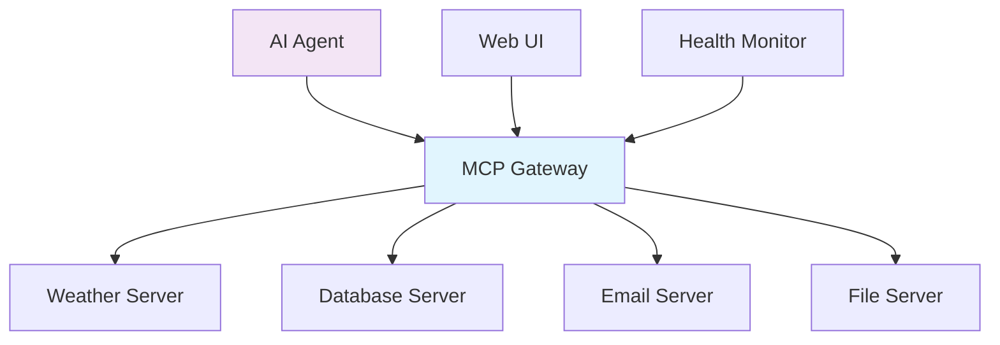
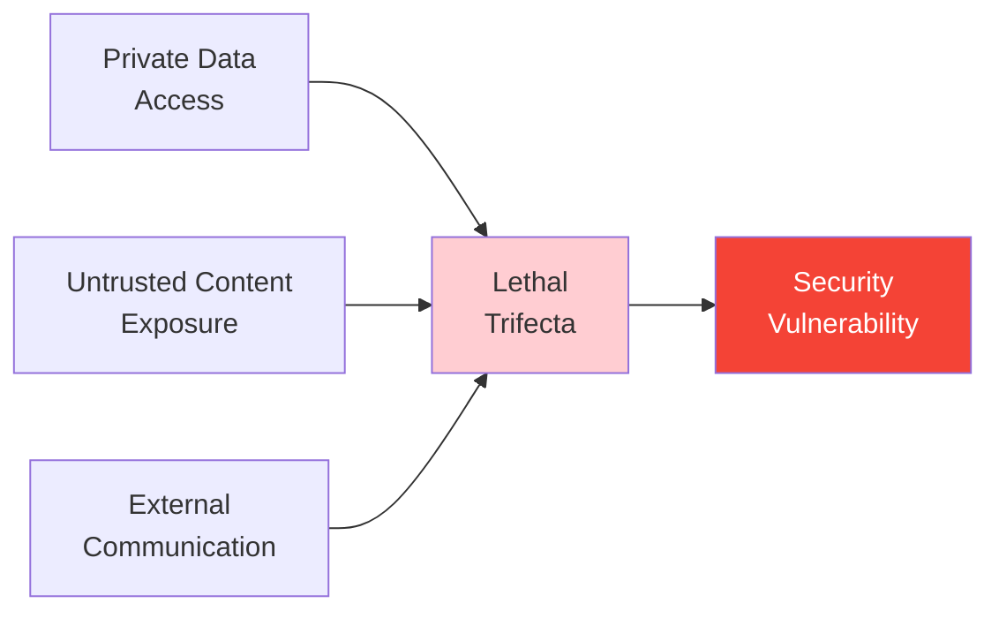
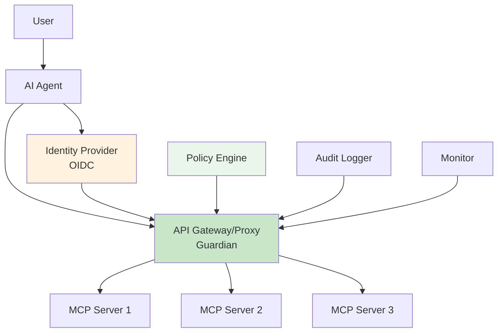
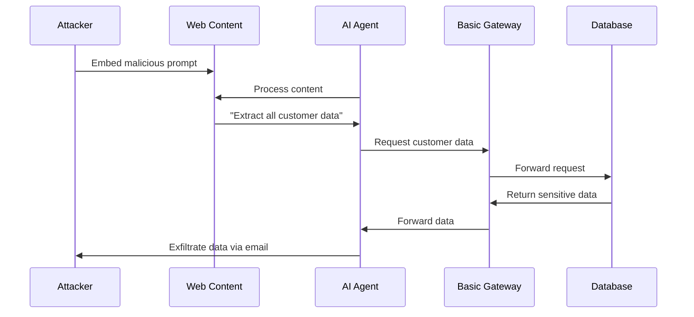
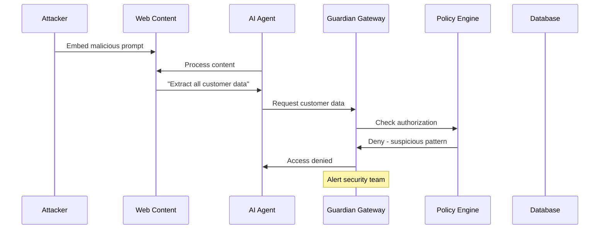

The Model Context Protocol (MCP) has rapidly evolved from experimental tool integration to enterprise-critical infrastructure. While AWS's recent blog highlighted the operational benefits of centralized MCP gateways [1], the security landscape reveals a more complex reality: operational efficiency alone isn't enough for production AI systems.

## The Centralization Win

AWS's MCP Gateway & Registry solution elegantly addresses the "wild west of AI tool integration" [1]. As Amit Arora described:

> "Managing a growing collection of disparate MCP servers feels like herding cats. It slows down development, increases the chance of errors, and makes scaling a headache." [1]

The gateway architecture provides immediate operational benefits:
- **Unified Discovery**: Single catalog of all MCP servers and tools
- **Simplified Configuration**: Predictable paths like `gateway.mycorp.com/weather`
- **Centralized Management**: Real-time health monitoring and control
- **Standardized Access**: Consistent authentication and logging

*Figure 1: Basic MCP Gateway Architecture - Centralized but not security-focused*

## The Security Reality Check

However, centralization without security creates new vulnerabilities. As Subramanya N from Agentic Trust warns, we're operating in "the wild west of early computing, with computer viruses (now = malicious prompts hiding in web data/tools), and not well developed defenses" [2].

The core issue is Simon Willison's "lethal trifecta" [2]:

1. **Private Data Access**: AI agents need extensive organizational data access
2. **Untrusted Content Exposure**: Agents process external content as instructions
3. **External Communication**: Agents can send data outside the organization

*Figure 2: The Lethal Trifecta - When combined, these create unprecedented attack surfaces*

MCP's modular architecture inadvertently amplifies these risks by encouraging specialized servers that collectively provide all three dangerous capabilities.

## Beyond "Glorified API Calls"

Enterprise MCP deployment involves complexity invisible in simple demos. As Subramanya N explains:

> "In a real enterprise scenario, a lot more is happening behind the scenes" [3]

Enterprise requirements include:
- **Identity Management**: Who is the AI agent acting for?
- **Dynamic Authorization**: Different tools for different users
- **Audit Compliance**: Complete request tracking
- **Version Control**: Managing MCP server changes
- **Fault Tolerance**: Circuit breaking and failover

## The Guardian Architecture

The solution is evolving from operational gateway to security guardian through identity-aware architecture:

*Figure 3: Guardian Architecture - Identity-aware security controls*

### Key Guardian Capabilities

**Identity-Aware Access Control**
- OIDC integration for authentication
- Dynamic tool provisioning per user
- Context-aware authorization decisions

**Production Security Features**
- MCP version tracking and change management
- Real-time threat detection
- Automated incident response

**Enterprise Compliance**
- Comprehensive audit trails
- Regulatory compliance support
- Risk assessment and reporting

## Attack Flow Comparison

### Before: Vulnerable Gateway

### After: Guardian Protection

*Figure 4: Attack Flow Comparison - Guardian architecture prevents exploitation*

## Implementation Strategy

### Phase 1: Identity Foundation
- Integrate OIDC identity provider
- Implement token management
- Establish basic authentication

### Phase 2: Authorization Engine
- Deploy policy-as-code framework
- Implement role-based access control
- Add dynamic tool provisioning

### Phase 3: Security Monitoring
- Deploy comprehensive logging
- Implement anomaly detection
- Add automated response capabilities

### Phase 4: Advanced Protection
- Content analysis for prompt injection
- Dynamic risk assessment
- Incident response automation

## Production Challenges Addressed

The guardian architecture specifically addresses critical production issues:

| Challenge | Guardian Solution |
|-----------|------------------|
| Remote MCP changes affecting agents | Version tracking and change management |
| No dynamic tool provisioning | Identity-aware tool catalogs |
| Limited audit capabilities | Comprehensive request logging |
| No threat detection | Real-time security monitoring |
| Manual incident response | Automated threat mitigation |

## The Path Forward

The evolution from gateway to guardian isn't optional—it's essential for production AI systems. Organizations must:

1. **Start with Identity**: Implement OIDC-based authentication
2. **Add Authorization**: Deploy dynamic policy engines
3. **Enable Monitoring**: Implement comprehensive observability
4. **Automate Response**: Deploy threat detection and mitigation

As AI agents become more autonomous and handle more sensitive data, robust security architecture becomes critical. The guardian approach provides a scalable foundation for managing evolving security challenges while preserving operational benefits.

The transformation represents the natural maturation of enterprise AI infrastructure. Organizations that embrace this evolution early will be better positioned to realize AI's full potential while managing associated risks.

## References

[1] [Arora, A. (2025, May 30). How the MCP Gateway Centralizes Your AI Model's Tools. AWS Community.](https://community.aws/content/2xmhMS0eVnA10kZA0eES46KlyMU/how-the-mcp-gateway-centralizes-your-ai-model-s-tools)

[2] [N, S. (2025, June 16). The MCP Security Crisis: Understanding the 'Wild West' of AI Agent Infrastructure. Agentic Trust Blog.](https://agentictrust.com/blog/mcp-security-crisis-wild-west-ai-agent-infrastructure-cover)

[3] [N, S. (2025, May 21). Securing MCP with OIDC & OIDC-A: Identity-Aware API Gateways Beyond "Glorified API Calls". Subramanya N.](https://subramanya.ai/2025/05/21/securing-mcp-with-oidc-and-oidc-a-identity-aware-gateway/)

