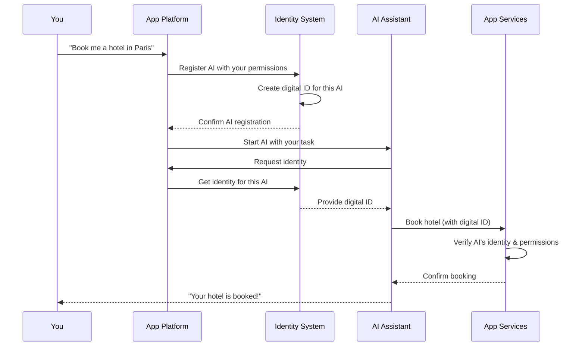
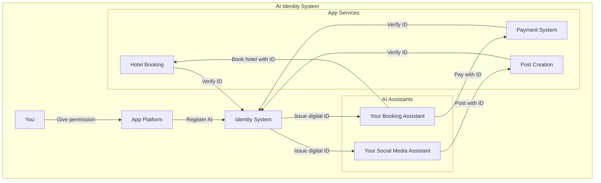

## When AI Acts on Your Behalf

Imagine you're using Booking.com's AI assistant to plan your vacation. It searches for flights, suggests hotels, and even makes reservations for you. But how does the payment system know this AI assistant is actually authorized to use your credit card? How does the hotel booking system know it's acting on your behalf?

This isn't just a hypothetical scenario. Today, AI assistants on platforms like Instagram, Facebook, and Booking.com are becoming more autonomous, taking actions for us rather than just answering questions. This shift creates a new challenge: **how do we securely identify AI agents and verify they're authorized to act on our behalf?**

## The Identity Problem for AI Agents

Traditional apps use simple API keys or service accounts for machine-to-machine communication. But AI agents are different for three key reasons:

1. **They're autonomous** - They make decisions on their own based on your instructions
2. **They're personal** - Your Instagram AI assistant acts differently than someone else's
3. **They're delegated** - They act on your behalf with your permissions

When Facebook's AI assistant posts a comment for you or Booking.com's AI makes a reservation, these platforms need to know:
- Which specific AI instance is making the request
- Who authorized it to act
- What specific permissions it has
- Whether it's behaving as expected

Without proper identity systems, these platforms risk unauthorized actions, inability to track which AI did what, and security vulnerabilities.

## How AI Identity Works: A Simple Flow

Here's how AI identity works when you use an AI assistant on a platform like Booking.com:

This process happens behind the scenes, but it ensures that AI agents can only do what they're specifically authorized to do.

## The Big Picture: AI Identity System

The diagram below shows how an AI identity system connects you, your AI assistants, and the services they use:

## Why Consumer Platforms Should Care

For platforms like Booking.com, Facebook, and Instagram, implementing proper AI identity has several benefits:

**For Users:**
- Peace of mind that AI assistants can't exceed their permissions
- Clear audit trails of what actions AI took on their behalf
- Ability to revoke AI access instantly if needed

**For Platforms:**
- Reduced security risks from compromised AI systems
- Better compliance with privacy regulations
- Ability to track and attribute all AI actions
- Improved trust from users who know AI actions are controlled

## Real-World Applications

Here's how this might look in practice:

**Booking.com**: When you authorize the AI assistant to book trips under $500, it receives a digital identity certificate with these specific constraints. If it tries to book a $600 hotel, the booking system automatically rejects the request because it's outside the authorized limit.

**Instagram**: Your AI assistant gets a unique identity that allows it to post content with specific hashtags you've approved. The platform can track exactly which AI posted what content, maintaining accountability.

**Facebook**: When the AI responds to comments on your business page, it uses its digital identity to prove it's authorized to speak on your behalf, and Facebook's systems can verify this authorization in real-time.

## The Path Forward

As AI assistants become more integrated into our favorite apps and platforms, proper identity systems will be essential. Frameworks like SPIFFE (Secure Production Identity Framework for Everyone) provide the foundation, but platforms need to adapt them for consumer AI use cases.

For users, this mostly happens behind the scenes, but the result is more trustworthy AI assistants that can safely act on our behalf without overstepping boundaries.

The next time you ask an AI assistant to book a flight or post content for you, remember that its digital identity is what ensures it can only do what you've authorized—nothing more, nothing less.

**References:**

[1] [SPIFFE - Secure Production Identity Framework for Everyone.](https://spiffe.io/)

[2] [Olden, E. (2025). "Why Agentic Identities Matter for Accountability and Trust." Strata.io Blog.](https://www.strata.io/blog/agentic-identity/why-agentic-identities-matter-1b/)

