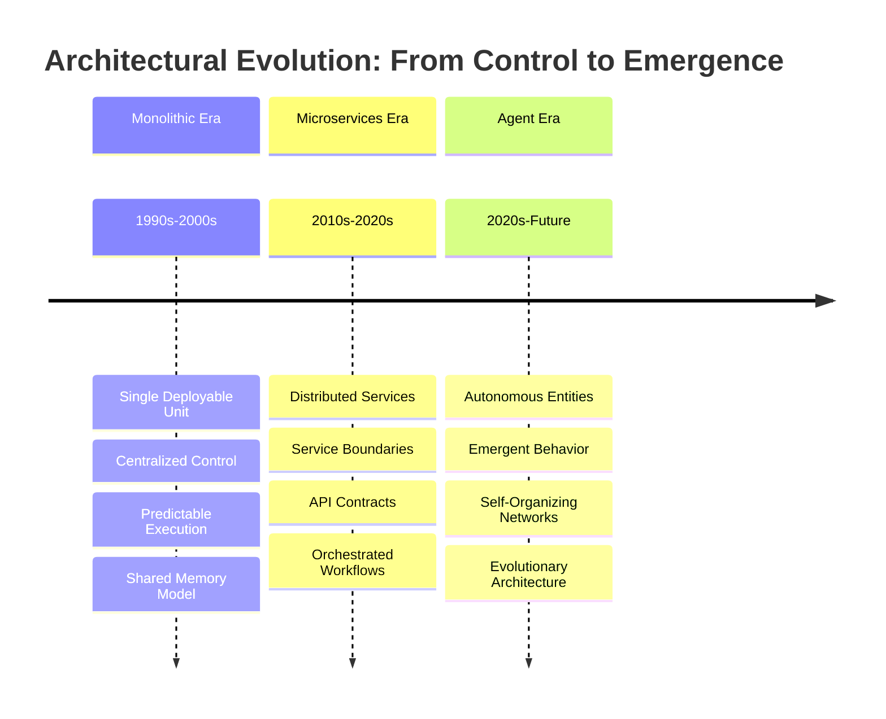
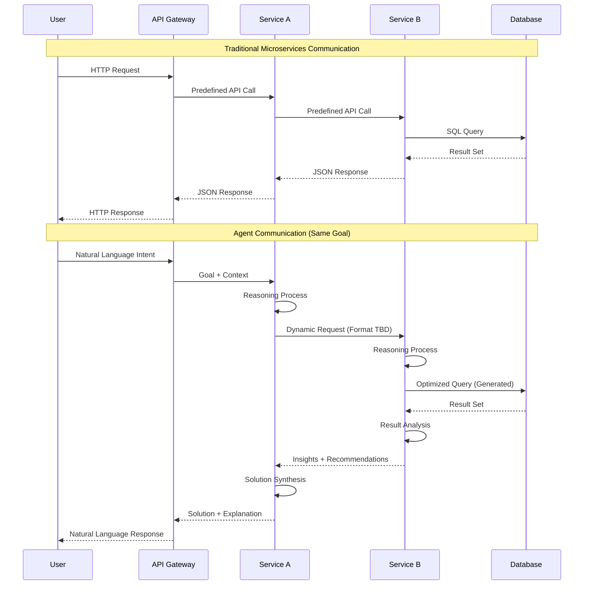
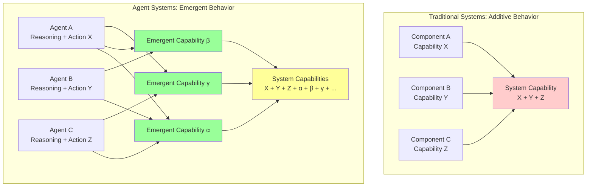
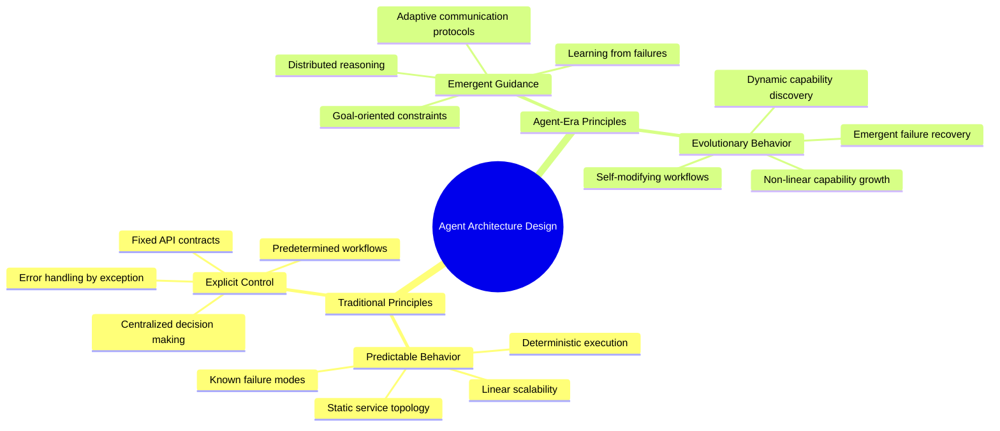

For decades, software architects have operated under a fundamental assumption: we design systems, and systems execute our designs. We draw diagrams, define interfaces, and specify behaviors. Our applications dutifully follow these blueprints, calling the APIs we've mapped out, processing data through the pipelines we've constructed, and failing in the predictable ways we've anticipated.

AI agents are rewriting this contract entirely.

Unlike the monoliths and microservices that came before them, AI agents don't just execute architecture—they evolve it. They make decisions we never programmed, forge connections we never specified, and solve problems through paths we never imagined. This isn't simply a new deployment pattern or communication protocol. It's the emergence of the first truly evolutionary software architecture, where systems adapt, learn, and fundamentally change their own structure during runtime.

The implications stretch far beyond adding "AI capabilities" to existing systems. We're witnessing the birth of software that exhibits emergent properties, where the whole becomes genuinely greater than the sum of its parts. For software architects, this represents both an unprecedented opportunity and a fundamental challenge to everything we thought we knew about building reliable, scalable systems.

## The Architecture DNA: From Blueprints to Evolution

To understand why AI agents represent such a radical departure, we need to examine the architectural DNA that has shaped software development for the past several decades. Each major architectural pattern emerged to solve specific problems of its era, but also carried forward certain assumptions about how software systems should behave.

The monolithic era gave us centralized control and predictable execution paths. Every function call, every data transformation, every business rule was explicitly coded and deterministically executed. When something went wrong, we could trace through the call stack and identify exactly where the failure occurred. The system was complicated, but it was knowable.

Microservices introduced distributed complexity but maintained the fundamental assumption of designed behavior. We broke our monoliths into smaller, more manageable pieces, but each service still executed predetermined logic through well-defined APIs. The communication patterns became more complex, but they remained static and predictable. We could still draw service maps and dependency graphs that accurately represented how our systems would behave in production.

AI agents shatter this predictability entirely. They don't just execute code—they reason, adapt, and make autonomous decisions based on context, goals, and learned patterns. An agent tasked with "optimizing system performance" might decide to scale certain services, modify caching strategies, or even restructure data flows—all without explicit programming for these specific actions. The system's behavior emerges from the interaction of autonomous entities rather than from predetermined design specifications.

This shift from designed to emergent behavior represents more than just a technical evolution. It's a fundamental change in how we think about software systems themselves. We're moving from mechanical metaphors—where systems are machines that execute instructions—to biological ones, where systems are living entities that adapt and evolve.

## The Fundamental Differences: Decision-Making in the Age of Autonomy

The most profound difference between traditional architectures and agent-based systems lies not in their technical implementation, but in how decisions get made. This shift fundamentally alters the relationship between architects, systems, and runtime behavior.

### Decision-Making Patterns Across Architectures

```mermaid
graph TD
    subgraph "Monolithic Decision Making"
        A1[User Request] --> B1[Application Logic]
        B1 --> C1[Business Rules Engine]
        C1 --> D1[Database Query]
        D1 --> E1[Response]
        style B1 fill:#ff9999
        style C1 fill:#ff9999
    end
    
    subgraph "Microservices Decision Making"
        A2[User Request] --> B2[API Gateway]
        B2 --> C2[Service A]
        B2 --> D2[Service B]
        C2 --> E2[Service C]
        D2 --> E2
        E2 --> F2[Aggregated Response]
        style C2 fill:#99ccff
        style D2 fill:#99ccff
        style E2 fill:#99ccff
    end
    
    subgraph "Agent Decision Making"
        A3[Goal/Intent] --> B3[Agent Network]
        B3 --> C3{Agent A<br/>Reasoning}
        C3 -->|Context 1| D3[Action Set 1]
        C3 -->|Context 2| E3[Action Set 2]
        C3 -->|Context 3| F3[Delegate to Agent B]
        F3 --> G3{Agent B<br/>Reasoning}
        G3 --> H3[Emergent Solution]
        style C3 fill:#99ff99
        style G3 fill:#99ff99
        style H3 fill:#ffff99
    end
```

In monolithic systems, decision-making follows a predetermined path through centralized business logic. The application contains all the rules, and execution is deterministic. Given the same input, you'll always get the same output through the same code path.

Microservices distribute decision-making across service boundaries, but each service still contains predetermined logic. The decision tree is distributed, but it's still a tree—with predictable branches and outcomes. Service A will always call Service B under certain conditions, and Service B will always respond in predictable ways.

Agent systems introduce autonomous reasoning at multiple points in the execution flow. Each agent evaluates context, considers multiple options, and makes decisions that weren't explicitly programmed. More importantly, agents can decide to involve other agents, creating dynamic collaboration patterns that emerge based on the specific problem being solved.

### Communication Patterns: From Contracts to Conversations

The communication patterns in agent systems represent an equally dramatic departure from traditional approaches:

Traditional microservices communicate through rigid contracts—predefined APIs with fixed schemas, expected response formats, and error codes. These contracts are designed at development time and remain static throughout the system's lifecycle.

Agent communication is fundamentally conversational. Agents negotiate what information they need, adapt their requests based on context, and can even invent new communication patterns on the fly. An agent might ask another agent for "insights about user behavior patterns" rather than requesting a specific dataset through a predetermined endpoint.

This shift from contracts to conversations enables agents to solve problems that weren't anticipated during system design. They can combine capabilities in novel ways, request information at different levels of abstraction, and collaborate to address complex scenarios that would require significant development effort in traditional systems.

## The Emergence Principle: When Systems Become Greater Than Their Parts

Perhaps the most fascinating aspect of agent-based architectures is their capacity for emergence—the phenomenon where complex behaviors and capabilities arise from the interaction of simpler components. This isn't just theoretical; it's a practical reality that fundamentally changes how we think about system design and capability planning.

### System Behavior Emergence

In traditional systems, the total capability is essentially the sum of individual component capabilities. If Service A handles user authentication, Service B manages inventory, and Service C processes payments, your system can authenticate users, manage inventory, and process payments. The capabilities are additive and predictable.

Agent systems exhibit true emergence. When agents with reasoning capabilities interact, they can discover solutions and create capabilities that none of them possessed individually. An agent trained on customer service might collaborate with an agent focused on inventory management to automatically identify and resolve supply chain issues that affect customer satisfaction—a capability that emerges from their interaction rather than being explicitly programmed into either agent.

This emergence isn't random or chaotic. It follows patterns that we're only beginning to understand. Agents tend to develop specialized roles based on their interactions and successes. They form temporary coalitions to solve complex problems, then dissolve and reform in different configurations for new challenges. The system develops a kind of organizational intelligence that adapts to changing conditions and requirements.

### The Unpredictability Paradox

This emergent behavior creates what we might call the "unpredictability paradox" of agent systems. While individual agent behaviors may be somewhat predictable based on their training and constraints, the system-level behaviors that emerge from agent interactions are fundamentally unpredictable. Yet these unpredictable behaviors often represent the most valuable capabilities of the system.

Consider a customer support scenario where multiple agents collaborate to resolve a complex issue. The customer service agent might identify that the problem requires technical expertise and automatically involve a technical support agent. The technical agent might determine that the issue is actually a product design flaw and involve a product development agent. The product agent might realize this represents a broader pattern and initiate a proactive communication campaign through a marketing agent.

None of these individual agents were programmed to execute this specific workflow, yet their collaboration produces a comprehensive solution that addresses not just the immediate customer issue, but also prevents future occurrences and improves overall customer experience. This is emergence in action—system-level intelligence that arises from agent interactions rather than explicit programming.

## Design Implications for the Future: From Control to Influence

The shift to agent-based architectures requires a fundamental rethinking of design principles. Traditional software architecture focuses on control—defining exactly what the system should do and how it should do it. Agent architecture focuses on influence—creating conditions that guide autonomous entities toward desired outcomes.

### New Design Principles for Agent Systems

This paradigm shift requires architects to think more like ecosystem designers than system engineers. Instead of specifying exact behaviors, we define environmental conditions, constraints, and incentive structures that encourage agents to develop desired capabilities and behaviors.

### From Specification to Guidance

Traditional architecture relies heavily on specification. We define interfaces, document expected behaviors, and create detailed system designs that teams implement. The assumption is that if we specify the system correctly, it will behave correctly.

Agent architecture requires a shift to guidance-based design. We establish goals, define constraints, and create feedback mechanisms that help agents learn and adapt. Rather than specifying that "Service A should call Service B when condition X occurs," we might establish that "agents should collaborate to optimize customer satisfaction while maintaining system performance within defined parameters."

This doesn't mean abandoning all structure or control. Instead, it means designing systems that can evolve and adapt while maintaining alignment with business objectives and operational constraints. We're moving from rigid blueprints to adaptive frameworks that can accommodate emergent behaviors while ensuring system reliability and security.

### The Role of the Architect in an Agent World

The architect's role evolves from system designer to ecosystem curator. Key responsibilities shift toward:

**Constraint Design**: Rather than defining exact behaviors, architects design constraint systems that guide agent decision-making toward desired outcomes while preventing harmful behaviors.

**Emergence Facilitation**: Creating conditions that encourage beneficial emergent behaviors while providing mechanisms to detect and redirect problematic emergence patterns.

**Evolution Management**: Establishing processes for monitoring system evolution, understanding emergent capabilities, and guiding the system's development over time.

**Interaction Pattern Design**: Defining frameworks for agent communication and collaboration that enable effective problem-solving while maintaining system coherence.

This represents a fundamental shift from deterministic to probabilistic thinking. Instead of asking "What will this system do?" we ask "What is this system likely to do, and how can we influence those probabilities toward desired outcomes?"

## Conclusion: Embracing Architectural Evolution

The transition from traditional architectures to agent-based systems represents more than just another technological evolution—it's a fundamental shift in how we conceive of software systems themselves. We're moving from a world where we build machines that execute our instructions to one where we cultivate ecosystems of autonomous entities that solve problems in ways we never imagined.

This shift challenges many of our core assumptions about software architecture. The predictability and control that have been hallmarks of good system design become less relevant when systems can adapt and evolve autonomously. Instead, we need new frameworks for thinking about emergence, guidance, and evolutionary development.

For software architects, this represents both an unprecedented opportunity and a significant challenge. The opportunity lies in building systems that can adapt to changing requirements, discover novel solutions, and continuously improve their capabilities without constant human intervention. The challenge lies in learning to design for emergence rather than control, and developing new skills for guiding evolutionary systems.

The future belongs to architects who can embrace this uncertainty and learn to design systems that are robust enough to evolve safely, flexible enough to adapt to unexpected challenges, and aligned enough to maintain coherence with business objectives. We're not just building the next generation of software—we're participating in the emergence of truly intelligent systems that will reshape how we think about technology, automation, and human-computer collaboration.

The architectural revolution is just beginning. The question isn't whether agent-based systems will become dominant—it's whether we'll be ready to design and manage them effectively when they do. 