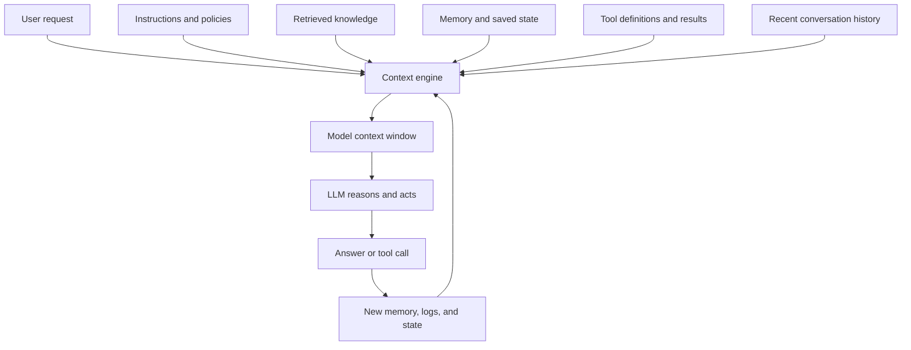
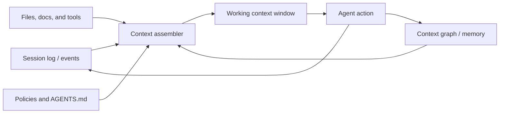

For a while, "prompt engineering" was the name we gave to the craft of getting good results from large language models. It made sense in the early days. Most people were using one-shot interactions, and the main lever really did feel like wording: ask more clearly, add an example, constrain the format, and the model behaved better.

That framing is now too small for the real problem.

When an AI system fails in production, the issue is usually not that the model needed one more clever sentence in the system prompt. The issue is that the model did not see the right information, saw too much irrelevant information, saw the right information in the wrong format, or could not carry the right state forward from one step to the next. In other words, the problem was not just the prompt. The problem was the **entire context pipeline**.

That is why the term **context engineering** has caught on. The phrase entered mainstream AI discussion in mid-2025, when Tobi Lütke and Andrej Karpathy argued that "prompt engineering" undersold the real work involved in building reliable LLM systems.[1] But the underlying discipline is older than the name. If you have built RAG, tool calling, memory systems, summarization, or evaluation loops, you have already done pieces of context engineering. What changed is that we finally have a name that describes the whole job.

## A Simple Mental Model

If you want the simplest possible picture, context engineering is the layer between the outside world and the model's working memory.

That is the whole game.

The model is the reasoning engine. The context engine decides what the model gets to reason over.

## The Name Is New. The Job Is Not.

One reason the term resonates is that it ties together several threads that had been evolving separately.

Retrieval-Augmented Generation, or RAG, taught us that models need access to external knowledge at inference time.[2] ReAct taught us that reasoning and acting work better when models can call tools, observe results, and continue from there.[3] Memory research taught us that long-running assistants need indexing, retrieval, and reading strategies rather than endless transcript accumulation.[4] Long-context evaluation showed that simply stuffing more tokens into a model is not the same thing as giving it better working memory.[5][6][7]

Seen this way, context engineering is not a replacement for those ideas. It is the umbrella above them.

That umbrella matters because modern AI systems are no longer isolated prompts. They are dynamic systems that assemble instructions, documents, structured data, tool outputs, and prior state into a temporary context window for the next step. LangChain described this well when it defined context engineering as the work of providing the right information and tools in the right format so the LLM can plausibly complete the task.[8]

The phrase "plausibly complete the task" is doing a lot of work there. It is the right test.

If an agent fails, the first question should not be, "How do I make the prompt smarter?"

The first question should be, "Did I actually give the model what it needed to succeed?"

## Why Prompt Engineering Became Too Small

Prompt engineering still matters. It just became a subset of a larger discipline.

The old mental model was:

| Prompt engineering | Context engineering |
|---|---|
| Write better instructions | Build the full information environment |
| Focus on a single request | Focus on multi-step systems |
| Mostly static | Dynamic and stateful |
| Optimize wording | Optimize selection, structure, memory, and tools |
| Improve a single model call | Improve the whole loop |

This distinction becomes obvious the moment you build an agent.

Suppose you are building a support agent for enterprise software. The user asks, "Why are our API requests timing out?"

If you think only in prompt terms, you might improve the wording:

- Ask the model to be concise
- Ask it to cite evidence
- Ask it to think step by step

Those are fine improvements. But they are not enough.

The real system questions are harder:

- Does the agent have access to the incident runbooks?
- Can it see the latest logs and status pages?
- Does it know which customer tier this account belongs to?
- Does it remember earlier turns in the conversation?
- Can it query the ticket system?
- Can it distinguish stale documents from current ones?
- If it gets too much context, what gets trimmed?

That is context engineering.

The prompt is one line item inside it.

## What Counts as Context

In practice, context includes everything the model sees at inference time, not just the visible prompt.[8][9]

That usually means:

- System instructions
- The current user request
- Retrieved documents
- Structured data like JSON, tables, schemas, and records
- Tool definitions
- Tool outputs
- Recent conversation history
- Long-term memory or saved notes
- Security, policy, and formatting constraints
- Environment state such as files, tabs, tickets, or working directories

This is why the phrase "filling the context window" has become so central. The context window is not just a place where text goes. It is the model's temporary working memory. Everything that enters it competes for attention.

And competition is the key word.

Every extra token is not merely additional information. It is also additional distraction.

## Why Bigger Context Windows Did Not Solve the Problem

One of the most common misconceptions in the current AI market is that larger context windows made context engineering less important.

The research points in the opposite direction.

*Lost in the Middle* showed that models often use long contexts unevenly, performing better when relevant information appears near the beginning or end and worse when important information sits in the middle.[5] Databricks' long-context RAG study found that while adding more retrieved documents can help, only a small number of state-of-the-art models maintained strong performance above 64k tokens.[6] Chroma's *Context Rot* report went even further: even simple tasks become less reliable as input length grows, especially when ambiguity and distractors are introduced.[7]

This is the part many teams learn the hard way.

Bigger windows do not eliminate the need to choose. They make the cost of bad choices less obvious at first and more painful later.

A long prompt can fail in at least four different ways:

1. **Context poisoning**: a bad fact, hallucination, or outdated result gets carried forward.
2. **Context distraction**: too much relevant-but-not-critical detail overwhelms the core task.
3. **Context confusion**: different pieces of context contradict each other.
4. **Context waste**: useful tokens are buried under redundant or low-value material.

This is why context engineering is not about maximizing tokens. It is about maximizing **signal density** inside the context window.

## From Retrieval to Navigation

This is where one of the best recent ideas enters the picture.

Jason Liu argued that the next step after classic chunk-based RAG is to stop thinking only about "the most similar passages" and start thinking about the **shape of the search space**.[10] His framing is especially useful because it maps out a progression that many teams are already moving through:

1. Minimal chunks
2. Chunks with source metadata
3. Better handling for multimodal and structured content
4. Facets and query refinement

The first three are improvements in what gets retrieved.

The fourth is more interesting. It improves what the agent learns **about the corpus itself**.

Facets give the model something like peripheral vision. Instead of returning only the top few chunks, the system can also return aggregated metadata:

- Which document types dominate the result set
- Which teams or owners appear most often
- Which dates cluster together
- Which categories are present but underrepresented in the top results

That matters because similarity search is biased toward what is easiest to match, not necessarily what is most important to inspect.[10] A retrieval system may over-surface well-documented resolved incidents and under-surface sparse, still-open incidents. A legal search may over-surface signed contracts and hide the unsigned ones that actually need attention. Facets help the agent see not just "what matched," but "what else exists nearby."

This is a major conceptual shift.

RAG was mostly about retrieval.

Context engineering is increasingly about **navigation**.

## The Six Jobs of Context Engineering

The easiest way to make context engineering concrete is to break it into the actual jobs it performs.

### 1. Selection

The first job is deciding what deserves to enter the window at all.

This includes retrieval, ranking, filtering, source choice, and freshness checks. It sounds obvious, but it is still where a huge amount of quality is won or lost. Benchmarks like BRIGHT show that realistic retrieval is much harder than surface-level semantic matching suggests.[11] If your retrieval quality is weak, no amount of downstream prompt polishing will fully save the result.

Selection is not just "find relevant chunks." It is:

- choose the right source
- choose the right granularity
- choose the right amount
- choose the right ordering

Good systems often retrieve less than naive systems, but retrieve it more intentionally.

### 2. Structure

The second job is deciding how the chosen context is represented.

The same information can be helpful or useless depending on formatting. Anthropic's tool-use guidance is explicit about this: tool descriptions and interfaces strongly shape model behavior.[9] Long-context prompting guidance makes similar recommendations for XML tagging, source labeling, and clearly separated document sections.[12]

In practice, structure means:

- label sources
- separate instructions from data
- wrap complex documents in consistent markup
- preserve tables as tables when they matter
- return citations and metadata with evidence

A short, well-labeled result often outperforms a giant JSON blob.

### 3. Compression

The third job is reducing context without destroying what matters.

This is where a lot of agent systems either get much better or much worse.

Compression can mean:

- summarizing earlier turns
- trimming stale history
- keeping only the last few user turns verbatim
- extracting durable facts from long threads
- caching stable prefixes to reduce cost and latency

OpenAI's prompt caching documentation shows that prompt order matters economically as well as cognitively: static shared prefixes are cheaper and faster when placed up front because cache hits depend on exact prefix reuse.[13] OpenAI's newer Responses API work on compaction pushes the same idea further by treating long-running agent history as something that should be compressed into a more token-efficient representation before the window fills up.[14]

Compression is not optional. The only question is whether you do it deliberately or let the context window degrade on its own.

### 4. Memory

The fourth job is deciding what should persist beyond the current turn.

This is where many teams make the same mistake: they confuse memory with transcript retention.

But good memory is not "keep everything forever." LongMemEval frames long-term memory as a three-stage problem: indexing, retrieval, and reading.[4] That is the right way to think about it. A memory system should help the model recover the right prior fact at the right moment, not drown it in the complete past.

This leads to a useful distinction:

- **Working memory**: the short-term context needed for the current task
- **Reference memory**: externalized facts, summaries, notes, or artifacts that can be reloaded later

If everything stays in working memory, the model gets distracted.
If everything gets pushed out, the model loses continuity.

Context engineering decides what belongs in each layer.

### 5. Tool and Interface Design

The fifth job is making tools legible to the model.

This is an underappreciated part of the discipline. A tool surface is not just software API design. It is also context design.

The model needs to understand:

- what the tool does
- when to use it
- what each parameter means
- what the output implies
- what to do next after seeing the result

This is why tool descriptions matter so much.[9] It is also why Jason Liu's emphasis on tool results is important.[10] The output of a tool does not merely answer the current query. It teaches the agent how to think about the next query.

When the tool surface becomes standardized through a protocol like MCP, this becomes even more important. MCP makes it easier to connect tools, resources, and prompts to LLM applications, but it does not decide what information should be surfaced, how it should be filtered, or how much of it should be injected into the next model call.[15] The protocol is the plumbing. Context engineering is still the craft.

### 6. Isolation and Orchestration

The sixth job is deciding when not to share context.

This is one of the biggest differences between toy demos and production agents.

Sometimes the right answer is not a larger shared prompt. It is multiple smaller prompts with isolated scopes.

Anthropic's multi-agent research system is a strong example.[16] Their subagents run in parallel with separate context windows, which helps them explore different branches of a problem without contaminating each other with every intermediate detail. LangChain describes a similar pattern under "isolate": sometimes the best way to improve agent reliability is to split contexts rather than accumulate them.[17]

This matters because shared context has a hidden cost. It creates path dependence. A single bad branch can influence the next step, and the next, and the next.

Isolation is a way to limit blast radius.

## What Changed in 2026

In 2025, context engineering was mostly a useful name for a problem people already felt. In 2026, it is starting to harden into an architecture.

The first big shift is that builders are moving durable state **outside** the raw context window. Anthropic's context editing and memory tool explicitly separate what stays live in the working window from what should persist across sessions.[18] OpenAI's January 2026 cookbook on personalization makes the same move in a different form: structured state objects that persist across runs and are deliberately injected back into working memory at the start of each run.[19] OpenAI's Responses API then pushes this one step further with native compaction, so long-running agent loops do not require every team to build a custom summarization subsystem from scratch.[14]

Anthropic's Managed Agents makes the underlying pattern unusually explicit: **the session is not the model's context window**.[20] That is a critical 2026 idea. The window is transient working memory. The session log is the durable object. The harness decides how to slice, compact, and rehydrate that durable context back into the next model call.

The second shift is that retrieval is becoming more **just in time** and more interface-native. Instead of front-loading every possibly relevant token, teams are giving agents retrieval surfaces they already know how to operate. Mintlify's ChromaFs is a good example: rather than booting a full sandbox for documentation retrieval, it presents docs as a virtual filesystem navigable with `ls`, `cat`, and `grep`, cutting p90 session creation from about 46 seconds to about 100 milliseconds.[21] Turso's AgentFS pushes the same intuition toward general agent execution: a copy-on-write filesystem abstraction with portable single-file storage and built-in auditing.[22]

The third shift is that **context graphs** are becoming an implementation direction, not just a metaphor. Foundation Capital's thesis made the term visible, but the stronger claim is architectural: when agents sit in the execution path, they can capture decision traces as durable artifacts, not just emit final outputs.[26][27] Open-source systems like Graphiti and commercial platforms like Zep operationalize this as temporal context graphs with validity windows, provenance episodes, and hybrid retrieval across semantics, keywords, and graph structure.[23] TrustGraph takes a related approach by treating context as a versioned artifact: graph, embeddings, evidence, and policies bundled into portable "context cores" that can be promoted or rolled back like build outputs.[24][25]

The fourth shift is that context engineering is now visible in real software practice, not just platform blogs. The 2026 MSR paper on context engineering in open-source software studied 466 repositories and found that AI context files such as `AGENTS.md` are spreading, but with no stable content structure yet.[28] That matters because it marks a move from theory to operational artifacts. Context is no longer just something inferred at runtime. It is being authored, versioned, reviewed, and mined as part of the software lifecycle.

If you want the 2026 mental model in one picture, it looks like this:

That is a very different architecture from "prompt + vector search."

## Where Context Graphs Actually Fit

One reason this conversation gets muddy is that people use **context engineering** and **context graph** as if they mean the same thing. They do not.

Context engineering is the broader discipline. It is the work of deciding what goes into the next context window, what stays out, what gets compressed, and what gets retrieved on demand.

A context graph is one possible long-term memory substrate inside that larger system.

That distinction matters because not every useful agent needs a context graph. A documentation assistant over mostly static content may need good retrieval, tool design, and compaction, but not a graph. A coding agent may get surprisingly far with repository instructions, a durable session log, and a filesystem abstraction.[20][21][22][28]

Context graphs become compelling when the problem has four characteristics:

- **Temporal truth matters.** You need to know not just what is true now, but what was true at decision time.[23]
- **Provenance matters.** You need to trace facts back to the episode, document, or interaction that produced them.[23][24]
- **Precedent matters.** The task depends on how similar cases were handled before, including exceptions and approvals.[26][27]
- **Cross-entity reasoning matters.** The useful memory is not a flat note, but a network of people, policies, incidents, accounts, tickets, and outcomes.[23][25]

This is why the best definition of a context graph, in my view, is not "a graph database for AI." It is a **durable representation of precedent**.

That is also why decision traces matter so much. Foundation Capital's framing is useful here: rules tell the agent what should happen in general; decision traces tell it what happened in a specific case, under real constraints, with real exceptions.[26] Once those traces are linked across entities and time, you get something much more valuable than generic memory. You get searchable judgment.

## How I Would Build It in 2026

If I were building a serious context-engineering stack today, I would not start with the graph. I would start with the interfaces and promotion rules.

### 1. Build a durable session layer first

Every action, tool result, observation, and important intermediate artifact should land in an append-only session log or event store. This is your recoverable context object.[14][20]

Do not confuse the active context window with the source of truth.

The window is for reasoning.
The session is for recovery, replay, debugging, and selective rehydration.

### 2. Treat the context assembler as a product surface

The assembler should explicitly manage:

- token budgets
- source priority
- freshness
- compaction thresholds
- history trimming
- citation formatting
- cache-aware ordering

This is the layer that decides what the model sees *now*. It should be observable, testable, and cheap to change.[18][19][14]

### 3. Prefer just-in-time retrieval over eager stuffing

Give the model lightweight handles first: file paths, object IDs, URLs, query templates, ticket IDs, incident IDs. Then let it pull detail only when needed.[9][18][21]

This is where filesystems, MCP tools, search APIs, and structured queries become more valuable than giant top-K dumps.

### 4. Promote only high-value state into long-term memory

Not everything should become memory.

I would promote four classes of artifacts:

- stable user or account preferences
- durable facts with provenance
- important intermediate summaries
- decision traces and exceptions

Everything else should stay in the session log until it proves it deserves promotion.

### 5. Build the context graph as a promoted memory layer

This is the part many teams invert.

The graph should not be your raw transcript in graph form. It should be the curated layer that sits above sessions and below real-time assembly:

- entities
- relationships
- time validity
- source episodes
- approvals
- exceptions
- outcomes

If you skip the promotion step, the graph becomes a dumping ground.
If you get promotion right, the graph becomes the memory of how the organization actually reasons.[23][26]

### 6. Package context like code

By 2026, one of the most promising ideas is to treat context as a versioned artifact. In software projects this shows up as `AGENTS.md` and other repository-specific context files.[28] In graph-native systems it shows up as context cores: portable bundles of ontology, graph structure, embeddings, provenance, and retrieval policy.[24][25]

This matters because context changes need the same operational discipline as code changes:

- review
- versioning
- rollback
- environment promotion
- evaluation

Once context becomes an artifact, it becomes governable.

### 7. Separate observability from intelligence

You need both:

- **observability of the agent run**
- **observability of the context system**

Those are not the same thing.

I want to know:

- what the model saw
- what it did not see
- what got compacted
- what was retrieved just in time
- what got promoted into memory
- what graph neighborhood was traversed
- which precedent actually influenced the action

If you cannot answer those questions, you are still debugging prompts in the dark.

## A Practical Maturity Model

If you are trying to evaluate where your own system stands, this maturity model is more useful than abstract definitions.

### Level 0: Prompt-Only

You have a system prompt, a user message, and maybe a couple of examples.

This can work surprisingly well for narrow tasks. It breaks quickly when the task requires fresh knowledge, persistence, or tools.

### Level 1: Retrieval-Enhanced

You add documents at runtime.

This is where many teams stop. It is also where many teams start seeing the limitations of naive chunking, ranking, and context bloat.

### Level 2: Agent-Aware

You now manage history, tool results, memory, and formatting intentionally.

This is the first level where "context engineering" becomes a useful term, because the system is no longer just prompt plus retrieval. It is assembling multiple forms of context dynamically.

### Level 3: Adaptive

The system changes how it builds context based on the task.

It may:

- choose among sources
- compress older history
- reload memory selectively
- route work to specialized tools
- isolate subproblems into separate contexts

At this point, context construction is part of the application's core logic.

### Level 4: Context-Native

The system treats context as a first-class engineering surface.

It has:

- explicit context budgets
- retrieval and generation evals
- metadata and facet-aware navigation
- memory policies
- observability around failure modes
- cost-aware prompt assembly

This is where the strongest production systems are heading.

## What Good Context Engineering Looks Like in Practice

If I had to reduce the whole discipline to a checklist, it would look like this:

1. Start with the task, not the prompt. Define what success looks like first.
2. Enumerate the context sources the model might need. Instructions, docs, tools, memory, state, policies.
3. Separate working memory from reference memory. Not everything should live in the active window.
4. Retrieve with intent. More chunks is not the same as better recall.
5. Structure context so the model can parse it quickly. Labels, sources, tables, and boundaries matter.
6. Design tools as if they are part of the prompt, because they are.
7. Trim aggressively. If you would not ask a human to reread it, do not force the model to reread it.
8. Measure retrieval and generation separately. Otherwise you will diagnose the wrong problem.
9. Use isolated contexts when tasks branch or can run in parallel.
10. Promote durable facts and decision traces intentionally. Not every transcript belongs in long-term memory.
11. Package critical context like code. Instructions, policies, and graph artifacts should be versioned.
12. Treat context bugs like software bugs. They should be observable, reproducible, and fixable.

None of this is glamorous. That is exactly why it matters.

Prompt engineering became popular because it sounded like a shortcut.

Context engineering matters because it describes the actual work.

## The Real Takeaway

The center of gravity in AI is moving.

The frontier question used to be: **How smart is the model?**

The applied question is increasingly: **What does the model get to see before it has to act?**

That is a different engineering problem. It is less about single prompts and more about systems design. Less about phrasing and more about information flow. Less about one-shot output quality and more about whether an agent can stay reliable over time.

This is why context engineering is going to keep growing as a discipline. The better models get, the more the remaining failures look like context failures. Missing state. Wrong tool. Bad retrieval. Bloated history. Poor formatting. Conflicting evidence. Weak memory. Unbounded loops.

The irony is that this makes AI systems feel more like classical software, not less. We are back to building pipelines, interfaces, state machines, memory hierarchies, caches, and observability layers. The novelty is that all of those pieces now exist in service of a probabilistic reasoning engine.

The name may be new. The direction is not.

Reliable AI systems will be built by teams that treat context as a first-class product surface.

Everyone else will keep calling the model flaky.

**References:**

[1] [Simon Willison. (2025, June 27). *Context engineering*.](https://simonwillison.net/2025/Jun/27/context-engineering/)

[2] [Lewis, P. et al. (2020). *Retrieval-Augmented Generation for Knowledge-Intensive NLP Tasks*.](https://arxiv.org/abs/2005.11401)

[3] [Yao, S. et al. (2023). *ReAct: Synergizing Reasoning and Acting in Language Models*.](https://arxiv.org/abs/2210.03629)

[4] [Wu, D. et al. (2025). *LongMemEval: Benchmarking Chat Assistants on Long-Term Interactive Memory*.](https://arxiv.org/abs/2410.10813)

[5] [Liu, N. F. et al. (2023). *Lost in the Middle: How Language Models Use Long Contexts*.](https://arxiv.org/abs/2307.03172)

[6] [Leng, Q. et al. (2024). *Long Context RAG Performance of Large Language Models*.](https://arxiv.org/abs/2411.03538)

[7] [Hong, K., Troynikov, A., and Huber, J. (2025, July 14). *Context Rot: How Increasing Input Tokens Impacts LLM Performance*.](https://www.trychroma.com/research/context-rot)

[8] [LangChain. (2025, June 23). *The rise of "context engineering"*.](https://blog.langchain.com/the-rise-of-context-engineering)

[9] [Anthropic. *How to implement tool use*.](https://docs.anthropic.com/en/docs/agents-and-tools/tool-use/implement-tool-use)

[10] [Jason Liu. (2025, August 27). *Beyond Chunks: Why Context Engineering is the Future of RAG*.](https://jxnl.co/writing/2025/08/27/facets-context-engineering/)

[11] [Su, H. et al. (2025). *BRIGHT: A Realistic and Challenging Benchmark for Reasoning-Intensive Retrieval*.](https://arxiv.org/abs/2407.12883)

[12] [Anthropic. *Long context prompting tips*.](https://docs.anthropic.com/en/docs/build-with-claude/prompt-engineering/long-context-tips)

[13] [OpenAI. *Prompt caching*.](https://platform.openai.com/docs/guides/prompt-caching)

[14] [OpenAI. (2026, March 19). *From model to agent: Equipping the Responses API with a computer environment*.](https://openai.com/index/equip-responses-api-computer-environment)

[15] [Model Context Protocol. *What is the Model Context Protocol (MCP)?*](https://modelcontextprotocol.io/)

[16] [Anthropic. (2025, June 13). *How we built our multi-agent research system*.](https://www.anthropic.com/engineering/built-multi-agent-research-system)

[17] [LangChain. (2025, July 2). *Context Engineering*.](https://blog.langchain.com/context-engineering-for-agents/)

[18] [Anthropic. (2025, September 29). *Managing context on the Claude Developer Platform*.](https://claude.com/blog/context-management)

[19] [Okcular, E. (2026, January 5). *Context Engineering for Personalization - State Management with Long-Term Memory Notes using OpenAI Agents SDK*.](https://developers.openai.com/cookbook/examples/agents_sdk/context_personalization)

[20] [Anthropic. *Scaling Managed Agents: Decoupling the brain from the hands*.](https://www.anthropic.com/engineering/managed-agents)

[21] [Mintlify. (2026, March 24). *How we built a virtual filesystem for our Assistant*.](https://www.mintlify.com/blog/how-we-built-a-virtual-filesystem-for-our-assistant)

[22] [Turso. *AgentFS*.](https://docs.turso.tech/agentfs/introduction)

[23] [Zep. *Graphiti: Build Real-Time Knowledge Graphs for AI Agents*.](https://github.com/getzep/graphiti)

[24] [TrustGraph. *The context development platform*.](https://github.com/trustgraph-ai/trustgraph)

[25] [TrustGraph. *Working with Context Cores*.](https://docs.trustgraph.ai/guides/context-cores/)

[26] [Gupta, J., and Garg, A. (2025, December 22). *AI’s trillion-dollar opportunity: Context graphs*.](https://foundationcapital.com/ideas/context-graphs-ais-trillion-dollar-opportunity)

[27] [Garg, A. (2026, January 16). *Why context graphs are the missing layer for AI*.](https://foundationcapital.com/ideas/why-context-graphs-are-the-missing-layer-for-ai)

[28] [Mohsenimofidi, S., Galster, M., Treude, C., and Baltes, S. (2026). *Context Engineering for AI Agents in Open-Source Software*.](https://arxiv.org/abs/2510.21413)
