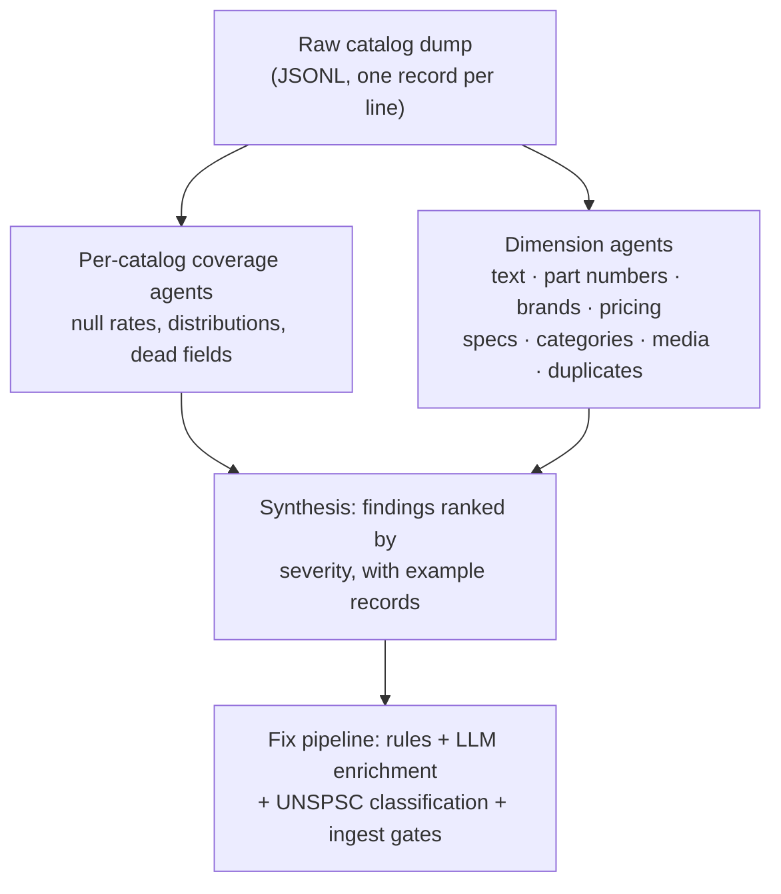
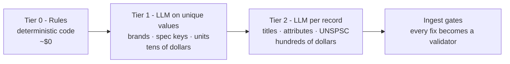

B2B commerce search has a dirty secret: the ranking algorithm is rarely the problem.

When results are bad, teams reach for the fun levers. Boosts, synonyms, embeddings, rerankers, and lately LLM query understanding. I've pulled all of those levers myself. Last week I did the unglamorous thing instead: I dumped every product record from four production search indices - 775,051 records across four B2B distributors in HVAC, plumbing, industrial supply, and fasteners - and audited the data itself. I used twelve AI agents running in parallel, each assigned one dimension: coverage, text quality, part numbers, brands, pricing, specs, categories, media, duplicates.

What came back would be unremarkable to anyone who has worked on a distributor's catalog, and shocking to anyone who hasn't. But the part that stuck with me is this: the fix is already published. Amazon, DoorDash, and Instacart have spent two years writing up, in public engineering blogs, exactly how they use LLMs to clean, label, and enrich messy catalogs at scale. Trade distribution mostly hasn't noticed. Which is strange, because its catalogs are messier, its queries are worth more (a contractor ordering a $4,000 condenser, not a $12 lunch), and its catalog sizes actually make the economics easier.

So this post is that playbook, adapted for trade distribution: the data problems that break B2B search, how to find them with a coding agent this afternoon, how to fix them with LLMs including UNSPSC categorization, and what the whole thing costs. Spoiler on the last one: less than you'd guess by two orders of magnitude.

## The playbook already exists, just not in our industry

Some of what the marketplace companies have published:

- DoorDash uses LLMs with retrieval-augmented generation to [build its product knowledge graph and improve search retrieval](https://careersatdoordash.com/blog/how-doordash-leverages-llms-for-better-search-retrieval/): automated brand extraction, attribute extraction, and entity linking across millions of merchant-supplied items.
- Amazon built [COSMO](https://www.amazon.science/blog/building-commonsense-knowledge-graphs-to-aid-product-recommendation), an LLM-generated knowledge graph that connects what customers mean ("shoes for pregnant women") to what products are ("slip-resistant shoes"). They report up to 60% improvement in recommendation performance in offline tests.
- Instacart put LLMs into the search stack to [generate discovery content](https://tech.instacart.com/supercharging-discovery-in-search-with-llms-556c585d4720) and is [rebuilding query understanding around them](https://www.instacart.com/company/tech-innovation/building-the-intent-engine-how-instacart-is-revamping-query-understanding-with-llms) - with the heavy generation done offline in batches, precisely to keep the cost down.

The common thread is easy to miss: the LLM wins are catalog-side and offline. These companies enrich the data before a single query arrives. Discovery systems split into an offline side that builds artifacts (the catalog, the indices, the embeddings) and an online side that retrieves and ranks over them, and nearly all the published LLM value lands offline. The ranking layer can only be as good as what it's fed.

Now picture a typical HVAC or plumbing distributor's catalog next to that. It's stitched together from ERP exports, supplier spreadsheets, buying-group feeds, and a CSV parser someone wrote a decade ago. The product "titles" are invoice shorthand written for warehouse pickers. And the search traffic hitting it is about as intent-dense as search traffic gets: half exact part numbers, the rest trade jargon like "3/4 cxc 90 ell." Honestly, I can't think of a better environment for this playbook. The queries are valuable, the data is fixable, and at a few hundred thousand SKUs, a full LLM pass over the catalog costs hundreds of dollars. Not millions. Hundreds.

Here's the audit shape, because you'll want to reproduce it:



One note on format before the prompts. Everything below works on a generic dump: one JSON object per line, each with a unique `id` and the record's fields. Elasticsearch, OpenSearch, Solr, Algolia, Typesense, a PIM, a plain database export - doesn't matter. Every platform can produce this shape, and every prompt here runs against it.

## Category 1: Silent pipeline failures

The worst thing I found wasn't bad data anyone wrote. It was data the pipeline destroyed on the way in, without telling anyone.

These catalogs build their primary search text at ingest time, using a scripted regex that extracts dimensions and units from product titles. On long titles the regex blows past the engine's complexity cap, the processor fails, and the record gets indexed anyway - with an error field nobody reads and no primary search field at all.


Across the fleet, 52,570 records were sitting in the index, invisible to the main query path. On the worst catalog that's one product in seven. No dashboard caught it because nothing failed. The pipeline returned success all day, every day, for months.

Two more findings from the same family. The stale mirror: one field holds the truth (a per-account entitlement map), and a second flattened field mirrors it for filtering. On one catalog the mirror had drifted on 19.85% of records - 31,000 active products wrongly hidden from account-filtered search. And the frozen catalog: one index hadn't refreshed in ten weeks while its siblings updated daily. Uptime was monitored. Freshness wasn't.

The fixes are boring and that's the point. Alert on derived-field coverage (derived field empty while its source isn't). Don't maintain two representations of one fact; derive the filterable field at write time. Watch data freshness per catalog the way you watch uptime.

Here's the prompt to find all of this in your own catalog (Claude Code or `codex exec`; mechanics at the end):

```text
Here is a dump of my product catalog as JSONL files in ./dump/ - one JSON
record per line, each with a unique "id" and the product fields. My field/
schema definition (if any) is in schema.json.

Write streaming Python (don't load it all in memory) to find silent pipeline
failures:
1. Records carrying any error/exception field a pipeline stamped on them.
2. For every DERIVED field (concatenations, *_search, *_normalized variants):
   records where the derived field is empty but its obvious source field
   is not.
3. Pairs of fields that look like mirrors of each other (one nested/rich,
   one flat/filterable): quantify how often they disagree.
4. The distribution of updated/indexed timestamps: is any slice of the
   catalog frozen while the rest refreshes?

Report each finding with counts, % of catalog, 5 example ids, and whether the
affected records are active/visible. Rank by severity.
```

## Category 2: Placeholders and sentinels, or: data that lies

Null checks are the data-quality tool everyone already has. Placeholders defeat them, because a placeholder is populated. It just isn't true.

My favorite example: on one 313K-SKU catalog, the brand field had 741 distinct values and 99.99% population. Sounds healthy. The top value, on 88.8% of all records, was "Approved Vendor." An ERP placeholder. The most popular real brand covered 0.3% of the catalog. So every brand facet, brand boost, and brand-aware rewrite was effectively dead for nine-tenths of the catalog, while the facet UI cheerfully offered "Approved Vendor" as the #1 brand filter.

Once you start looking, this stuff is everywhere:

- A "no price" sentinel of `99999999.000000` on 55% of one catalog. The median price of that index was ninety-nine million dollars.
- Product names literally `"unknown"` on 64 records, which then rank for the query "unknown."
- A boolean `true` written into a text description field on 1,516 live products. The engine coerced it to the string "true," which made those products findable by searching "true."
- 227 UPCs stored as `"6.71E+11"` - Excel's scientific notation, with 51 unrelated products sharing that one "identifier" - plus 15,121 more UPCs missing their leading zero. Excel strikes again.
- A fastener catalog whose brand field held product line names ("C6L Lockbolts", "Tool Parts") while the actual brand sat one field over.

The lesson I took from this category: audit top-N value distributions per field, not null rates. A field that's 100% populated can be 88% garbage, and no null check will ever tell you. Then blocklist the sentinels at ingest, map them to real nulls with explicit `has_price` / `has_real_image` flags, type-assert at the boundary, and validate identifiers structurally. Treat anything that ever passed through a spreadsheet as suspect.

```text
Same JSONL dump. For every field in my catalog, compute the top-20 value
distribution (full pass, streaming).

Flag: (a) any single value covering >10% of records - placeholder/sentinel
candidates like "Approved Vendor", "unknown", 99999999, 0.0; (b) values whose
type differs from the field's dominant type (booleans in text fields, floats
among strings); (c) identifier fields (UPC/EAN/GTIN/part numbers): validate
checksum and length, flag scientific notation, stripped leading zeros,
embedded whitespace/unicode, and identifiers shared by multiple records;
(d) category-like or product-line values sitting in brand fields.

For each flag: count, % of catalog, 5 verbatim examples with ids, and a
one-line proposed ingest rule that would have rejected it.
```

## Category 3: Impoverished content

Distributor catalogs are written by ERPs, not merchandisers. The text is invoice shorthand: `PROPRESS 2-1/2X1 CXC RED CPLG`, `HC HX 18X8 W`. On one catalog, a third of product names had fewer than 60% dictionary words. On another, the raw name and description fields were 100% null - the text only existed inside derived search blobs, so everything that read the raw fields (result titles, embedding inputs, relevance-judge prompts) was reading nothing and nobody knew.


That heatmap is my single favorite artifact from the audit. Every one of those fields exists in every schema. The numbers are how much of each actually holds data. The row that gets me is the ML-descriptions one: the enrichment layer the schemas promised on every record was populated on eighteen documents out of 775,051. Eighteen. Every "use enrichment if present" branch in the scoring pipeline was a silent no-op. Schema is an aspiration; only coverage is a fact.

This category is where the published playbook applies most directly - DoorDash's attribute extraction, Instacart's offline generation - and the cost section below prices it out. But four rules matter in a part-number business, learned partly from what the previous enrichment attempt got wrong:

- Expand, don't replace. Generate the customer-readable title alongside the raw invoice string and index both. The counter tech's query and the homeowner's query should both hit.
- Never verbalize codes. Those eighteen pioneer records? The generator had spelled model numbers out in words: "RGF one hundred eighty." No contractor will ever type that. Codes stay verbatim; expansions are additions, not replacements.
- Extract structure while you're in there. The same pass that rewrites a title can emit `{size, material, connection_type}` for facets.
- Trade jargon is a synonym problem, not a rewrite problem. `CXC`, `ELL`, `CPLG`, "t-stat" belong in analyzer-level synonym expansion, fixed once. Don't pay to rewrite them into half a million records.

```text
Same dump. Assess text quality of the customer-facing fields (name, short/long
description) with a full streaming pass:

1. Effective-title coverage: % of ACTIVE records with a non-empty display name.
2. Readability: % ALL-CAPS names; % with under 60% dictionary-word tokens
   (abbreviation salad); names under 10 chars; digits-only descriptions.
3. Junk: HTML/CMS markup, encoding artifacts, embedded operational notes
   (*** NOT A PHYSICAL ITEM ***), CSV column spillover.
4. Duplication: identical short/long descriptions; boilerplate shared by 20+
   SKUs; exact-length clusters (254/255/500 chars) indicating upstream
   VARCHAR caps.
5. Enrichment reality check: for every ML/enriched/embedding field the schema
   promises, its actual coverage.

Numbers, 5 verbatim examples each, severity, and which issues need an LLM
enrichment pass vs. a pipeline fix vs. a synonym-layer fix.
```

## Category 4: Part numbers are sacred

Half of B2B search traffic is someone typing a part number. Exact match is the whole game there, and it fails in quiet ways.

On one catalog, the indexed part number was an internal numeric SKU on 99.99% of records. The manufacturer's number - the one printed on the box - existed only inside free-text descriptions. 183,000 products unreachable by the number a customer would actually type.

Another catalog had a variant-expansion system: strip the dashes, collapse the segments, index the variants so forgiving PN search works. Good idea. But the generator was combinatorial (up to 80 variants per product), and on 11,826 records a generated variant of one product exactly equaled the canonical part number of a different product. Fasteners are the brutal case, because punctuation encodes physical dimensions: `702-1-5/32` is a 1-5/32 inch part and `702-15/32` is a 15/32 inch part, and both normalize to `7021532`. A customer types an exact part number and gets a coin flip between the right part and its dimensional cousin.

Also in this category: competitor cross-references ("I have the Ferguson number, what's yours?") stored as unsplit pipe-delimited blobs like `19MU82|Fastenal 0269214|Ferguson M48222407`, in fields configured as unsearchable, so a core B2B selling motion just doesn't work. And whitespace forks - the same part number indexed three times (plain, NBSP-padded, trailing-space) - plus mojibake twins from double-decoded UTF-8.

The principle that fixes most of this: exact must beat fuzzy structurally, not probabilistically. A punctuation-preserving exact clause scored strictly above any normalized tier, never one flat match where a variant can tie a canonical hit. Check generated variants against the canonical PN space before indexing and drop collisions. Unicode-normalize before deriving record IDs. Split the cross-reference blobs into arrays; that one is a single line of ingest code that unlocks an entire query class.

```text
Same dump. My users search by part number; audit exact-match integrity:

1. Which PN-ish fields exist (part_number, mpn, alt/competitor/customer PNs,
   UPC), their coverage, and which are configured unsearchable while holding
   real data.
2. Records whose only searchable PN token is an internal SKU (real
   manufacturer PN appears only inside description text - show the pattern).
3. If there's a PN-variant/keyword expansion field: find every generated
   variant that equals a DIFFERENT record's canonical PN (normalize:
   lowercase, strip punctuation). Show colliding pairs - especially
   fraction-bearing fastener sizes.
4. PNs differing only by whitespace/invisible chars/case from another
   record's PN (duplicate identity forks).
5. Multi-value cross-reference fields stored as delimited blobs instead of
   arrays.

Counts, examples, and for each issue the ingest rule or query-builder change
that fixes it.
```

A few things that didn't fit above but deserve a sentence: a synonym generator that turned any number into wire-gauge terms, so `REF#259286` became "259286 awg" and a `#8-32` screw thread became "8 gauge wire" (thousands of records now match electrical queries they have nothing to do with); an e-commerce platform's internal flags indexed as searchable product specs, 2.1 million junk key-value pairs; and 18 schema fields populated on zero records anywhere. Expansion generators need context gates. Dead schema is a false promise someone will eventually build on.

## The missing layer: UNSPSC, and products that don't know what they are

There's a fifth problem that deserves its own section, because it's where trade distribution lags furthest behind the marketplaces: categorization.

In my audit, category fields were missing on 83% of one catalog. Attribute keys had no taxonomy at all - 7,068 distinct spec keys on one 156K-record catalog, 64% of them used on fewer than ten products, with drift like `horse_power` vs `horsepower` splitting the same attribute across facets. And the detail I keep coming back to: two of the four catalogs had UNSPSC fields sitting in their schemas, mapped and ready, populated on exactly zero records. Someone knew categorization mattered, built the slot, and never filled it. I'd bet money on why: classifying 300K SKUs into a taxonomy by hand is a year of catalog-team work, so it stayed on the roadmap forever.

If you're outside B2B, UNSPSC is the UN Standard Products and Services Code, the taxonomy that procurement systems speak. This is the part consumer search doesn't have: your customers' purchasing systems require it. Punchout catalogs, e-procurement platforms, and spend-analysis tools are built around UNSPSC codes. A distributor whose catalog carries clean codes can plug into a contractor's or a hospital's purchasing system. One without them is a PDF price list with a search box. Internally it's also what powers category facets, category-scoped ranking ("a number that parses as a wire gauge should only boost wire"), cross-catalog dedup, and the context gates for every expansion generator in Category 4.

And it's now a batch job. This is the same shape of problem DoorDash describes solving with LLMs - high-volume labeling against a controlled vocabulary - and the approach transfers directly:

- Classify hierarchically, not flat. UNSPSC has four levels (segment, family, class, commodity). Have the model pick the family from ~450 options, then the class within that family. Two small constrained choices beat one 50,000-way choice, and you can feed the relevant taxonomy slice into context the way DoorDash constrains entity linking to its vocabulary.
- Stop at class level first. Class codes already unlock facets and procurement integration; commodity-level precision can come later where it earns its keep.
- Route by confidence. A small model takes the clear cases, low-confidence records escalate to a bigger model, and persistent disagreements go to a human queue that doubles as your eval set.

The cost is almost embarrassing to type. Classification is a short-output task: roughly 300 input tokens per record and 30 out. On Claude Haiku 4.5 at Batch API pricing that's about 17 cents per thousand SKUs. My entire 775K-record fleet would classify for about $130. The thing that sat on the roadmap for years because it was a year of manual work costs less than the team lunch where you'd discuss it.

```text
You classify B2B distributor products into UNSPSC. Attached: the UNSPSC
family list (level 2, ~450 entries) as reference data.

For each product record (title, description, brand, part number, any existing
category text), output JSON:
- unspsc_family: the 4-digit family code - choose ONLY from the attached list
- family_confidence: high | low
- rationale: one short phrase (e.g. "copper press fitting -> pipe fittings")

Rules: judge from the product's function, not its brand. Trade shorthand:
CXC/FPT/MPT are pipe connections, ELL is elbow, CPLG is coupling, a bare
fraction+material is usually a fitting size. If the record is not a physical
product (freight lines, upcharges, "*** NOT A PHYSICAL ITEM ***"), output
NOT_A_PRODUCT. Use low confidence liberally - low-confidence records get a
second pass with the class-level list.
```

## The cleanup playbook, with the actual bill

The fix pipeline has three tiers plus the classification job. The trick is spending at the right tier, because you almost never need an LLM call per record.



**Tier 0 is deterministic code and it's basically free.** Strip HTML and decode entities. Turn sentinels into real nulls with explicit flags. Repair UPCs (left-pad, reject scientific notation, validate the check digit). Unicode-normalize IDs. Split the pipe-delimited cross-references. Drop PN variants that collide with another product's canonical number. Delete dead schema. An agent writes these scripts in a session, and this tier fixed roughly half of everything my audit found. Do it before any enrichment, or you'll pay a model to beautifully rewrite titles for products your pipeline silently dropped.

**Tier 1 runs the LLM over unique values, not records.** This is the trick that makes vocabulary problems cheap: my worst catalog had 313K records but only 741 distinct brand strings. Brand normalization is one job over 741 strings - cluster the casing variants, map sub-brands to parents, flag the placeholders - not 313K calls. Same move for spec keys and unit suffixes. Each vocabulary job is single-digit dollars and its output is a static alias table your ingest applies forever, deterministically. Call the whole tier $20-50 for a fleet, mostly spent on review passes.

```text
Attached: the full distinct-value distribution of my brand and manufacturer
fields (value, record_count). Produce a normalization table:

canonical_brand, parent_manufacturer, [raw variants], confidence

Rules: cluster case/punctuation/whitespace variants; map sub-brands to parent
manufacturers as a separate column (don't merge); mark placeholder values as
NULL_SENTINEL; mark product lines or categories misfiled as brands as
NOT_A_BRAND. Flag uncertain clusters rather than guessing. Output CSV, then
write a script that applies it at ingest and logs unmatched new values.
```

**Tier 2 is the per-record pass**: a customer-readable title, search expansions, structured attributes, and a recovered manufacturer part number for every product. Per SKU it's small - around 400 input tokens (the record, plus shared instructions that prompt caching makes nearly free) and 250 out. Two levers before you even pick a model: enrich what's live (on my worst catalog only 14% of records were active, an 86% cut right there), and use a batch API where the provider has one, since enrichment has no latency requirement and both Anthropic and OpenAI knock 50% off for batch.

I priced the same job across everything you'd plausibly use in 2026 - Claude, [GPT-5.6's three tiers](https://openai.com/index/advancing-the-price-performance-frontier-with-gpt-5-6/) (Sol, Terra, Luna), Kimi K3, GLM-5.2, Qwen3.5, and [DeepSeek V4](https://deepseek.ai/pricing). Same workload, provider-published rates, batch discount applied where it exists:


I had to double-check these numbers because they felt wrong. The worst-case version of this project - a frontier model, every single SKU, no filtering at all - tops out around $3,800. The floor is under a hundred dollars: DeepSeek V4-Flash would enrich the entire fleet for about the price of a decent drill. The version you'd actually run mixes tiers: a budget model (Haiku, Luna, Qwen Flash, DeepSeek) for the mechanical majority, a mid-tier model (Sonnet, Terra, GLM-5.2) for the abbreviation-salad tail the small one flags as low-confidence, and a frontier model spot-checking a 1-2% sample as the quality gate. That lands at a few hundred dollars for the live SKUs regardless of which vendors you pick.

Two caveats the chart can't show. Cheap models are only cheap if their output survives your eval - run the 200-sample comparison before committing, because a budget model that mangles 5% of part numbers costs more than the frontier model that doesn't. And your catalog is competitive data: pricing, cross-references, and customer part numbers are in those records, so check each provider's data-retention and training terms before shipping 775K records to the cheapest endpoint on the list. For plenty of distributors that check alone rules some vendors in or out, and the open-weight options (DeepSeek, GLM, Qwen, Kimi) have the extra property that you can self-host them if the data can't leave at all.

Add the ~$130 UNSPSC pass (which scales the same way across models - on the budget tier it drops to pocket change) and the vocabulary work, and the entire catalog transformation runs somewhere between a few hundred and a few thousand dollars, against work that used to be a merchandising team's year. It's the same offline-batch economics Instacart describes, just at trade-catalog scale where the numbers get small enough to put on a credit card.

What it looks like on a real record from my audit:

```text
IN:  part_number: 1678619
     short_desc:  PROPRESS 2-1/2X1 CXC RED CPLG 20685
     brand:       (placeholder)

OUT: display_title:      2-1/2" x 1" ProPress Copper Reducing Coupling
     search_expansions:  ["copper press fitting", "reducing coupling",
                          "press x press coupling"]
     attributes:         {size_1: {value: 2.5, unit: in},
                          size_2: {value: 1, unit: in},
                          material: copper, connection: press}
     extracted_mpn:      "20685"
     unspsc_family:      4017 (pipe fittings)
     confidence:         high
```

Look at the `extracted_mpn` line. The same pass recovers manufacturer part numbers that were previously buried in description text - on one of my catalogs that's 183K products becoming findable by the number printed on the box. That alone pays for the batch job.

```text
You enrich B2B distributor product records for search. For each input record
(raw ERP name, descriptions, brand, part number, category) produce JSON:

- display_title: customer-readable, <=80 chars, Title Case. Expand trade
  abbreviations (CXC -> copper x copper connection, ELL -> elbow, CPLG ->
  coupling, RED -> reducing). Keep every part number, model code, and
  dimension VERBATIM as typed - never spell codes out in words.
- search_expansions: 2-5 phrases a customer might type that don't appear in
  the raw text (plain-English product type, common trade names). Never invent
  specs absent from the source.
- attributes: {name: {value, unit}} extracted ONLY from the source text.
- extracted_mpn: manufacturer part number if present in the description text
  (usually the token after the brand) and absent from the PN fields, else null.
- confidence: high | low. Use low whenever you had to guess; a low answer
  routed to review beats a confident hallucination.
```

Two production notes: put the shared instructions in a cached prompt prefix (caching cuts the input side by up to 90% on top of the batch discount), and use structured outputs with a JSON schema so you never pay a parse-failure tax.

**The last tier is the one people skip, and it's the one that compounds.** The audit is worth one cleanup. The validators it generates are worth every future feed. End the fix session with:

```text
Turn every issue we just fixed into an automated check that fails the ingest
pipeline loudly: derived-field coverage assertions, sentinel blocklists, type
assertions on text fields, identifier checksum validation, PN-variant
collision checks, id hygiene rules, UNSPSC coverage tracking, and a data-
freshness alarm per catalog. Emit them as tests CI runs against a sample of
every new feed.
```

Skip this and the same ERP exports will regenerate the same garbage within a quarter, and you'll pay for the cleanup twice. I know because two of the bugs my audit found had clearly been fixed before, and had come back.

## Running the prompts

One setup step: dump your catalog to JSONL, one JSON object per line with a unique `id` and the record's fields. Whatever your platform is - Elasticsearch, OpenSearch, Solr, Algolia, Typesense, a PIM, the database behind all of it - just ask the agent to write the exporter:

```text
Write a script that exports every product record from my catalog [describe:
search index name / database table / PIM export] to ./dump/records-{n}.jsonl
in 50k-record chunks - one JSON object per line with a unique "id" plus all
fields - and my field/schema definition (if the platform has one) to
schema.json. Verify the exported count matches the source count.
```

With Claude Code, drop any category prompt into a session in that directory. It writes and runs the analysis itself, full passes with no sampling excuses, and comes back with record-level receipts. When you say "now fix it," the same session produces the ingest validator, the backfill script, and the batch-enrichment job. Run the categories as parallel sessions or subagents; that's how I ran mine, and the whole audit took about twelve minutes of wall-clock time. With Codex, `codex exec` handles the read-only analysis passes using the same prompts; keep the write-side fixes in a session you review.

Three rules I learned the hard way:

1. Demand full passes and receipts. "Analyze this data" invites sampling and vibes. Ask for exact counts and five example record IDs per finding, and every claim becomes checkable.
2. Rules before enrichment. Fix truth before adding prose, or you'll hallucinate brands for the 88% of records labeled "Approved Vendor."
3. Sample, eval, then batch. Never fire a 775K-record batch from an unvalidated prompt. 200 samples, a scoring pass, then scale. The eval harness costs one agent session and de-risks the whole spend.

## The trades deserve marketplace-grade search

Amazon, DoorDash, and Instacart didn't publish their catalog-LLM work as charity. They published it because the techniques are general and the moat is execution. And the techniques transfer to trade distribution better than almost anywhere else I can think of: the catalogs are small enough that a full pass is cheap, the data is bad enough that the headroom is enormous, the queries carry real money, and the procurement world already runs on a taxonomy that a batch job can now populate for about $130.

Of the dozens of issues my audit surfaced across four distributor catalogs, not one was visible from the ranking layer. All of them degraded it. The supply chain feeding those indices - the ERP exports, the supplier spreadsheets, the ancient CSV parsers - is exactly what the published playbook fixes. The distributors who run it will have marketplace-grade search on catalogs where their competitors still can't find a condenser coil.

The question "is anything wrong with my data?" used to cost two weeks of someone's time, which is why nobody asked it. It now costs one prompt. Ask it.
